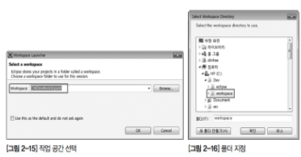
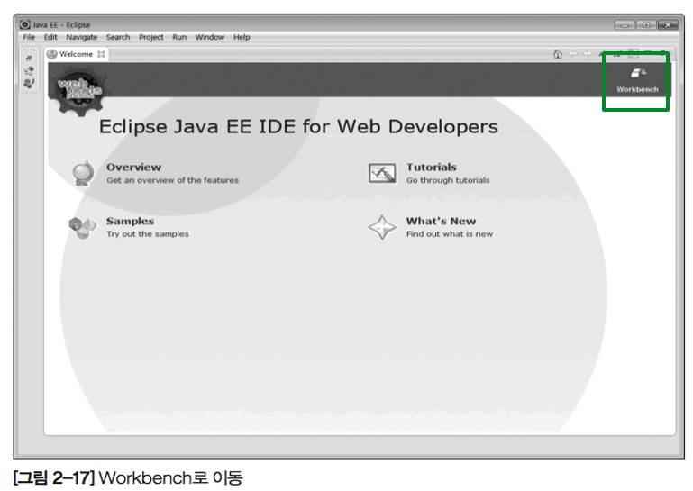
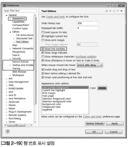
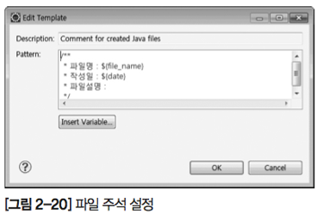
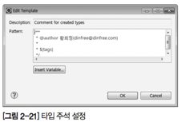
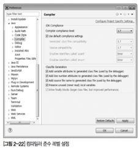
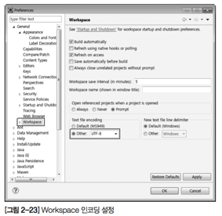
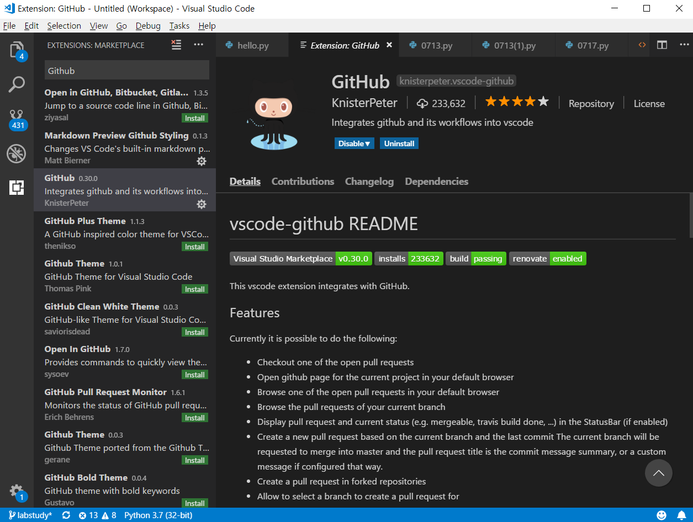

# [STS-10] 웹프로그래밍 :: 짧고 굵게 배우기

[![Dinfree][din-badge]][din-url]
[![Subject][basic-badge]][din-url]

[STS-10]은 웹프로그래밍의 핵심 개념에서 부터 주요 기술인 html, css, javascript를 비롯해 필수 응용 라이브러리인 bootstrap, jquery까지를 다루는 과정 입니다.

 ## 개발 도구 설치
JDK, eclipse, mySQL, tomcat, Visual Studio Code 개발도구를 설치하는 방법입니다.
### 목차
1. [JSP 개발환경 개요](#m0)
1. [JDK](#m1)
2. [eclipse](#m2)
3. [mySQL](#m3)
4. [tomcat](#m4)
5. [Visual Studio Code](#m5)

---

## 1. JSP 개발환경 개요
- JSP 개발환경을 구축하려면 여러 개발 툴을 상호 연동하여 설치해야 한다. 먼저 JSP는 자바 로 구현되므로 자바 개발환경이 필요합니다. 또한 작성한 코드를 웹 서버에서 실행하려면 JSP 운영환경이 필요하고, 자바를 이용한 편리한 개발을 위해 통합 개발환경도 필요합니다. 
- 개발환경을 구축할 때는 안정적인 하드웨어와 검증된 운영체제를 사용하는 것이 좋습니다. 문제가 생기면 자칫 개발 중인 중요한 소스를 날릴 수도 있고 개발이 지연될 경우 전체 프로젝트에 막대한 지장을 초래합니다. 
- 이 책에서는 기본적인 컴퓨터 운영체제로 윈도우 7을 사용할 것입니다. 그러나 [표 2-1]에서 소개한 자바 개발환경은 리눅스, 매킨토시 등 다른 운영체제에서도 동일한 버전을 설 치할 수 있으므로 해당 운영체제에 익숙하다면 굳이 윈도우를 사용할 필요는 없습니다.

| 항목                          | 필요 프로그램 |
|-------------------------------|---------------|
| 자바 개발환경                 | JDK           |
| JSP 운영환경(서블릿 컨테이너) | 아파치 톰캣   |
| 통합 개발환경                 | 이클립스      |

## 2. JDK

- 자바는 썬 마이크로시스템즈(Sun Microsystems, 이하 썬)에서 만든 프로그래밍 언어로 현재는 데이터베이스로 유명한 오라클에서 썬을 인수하였습니다. 
- 자바는 객체지향 언어로서, 하드웨어와 운영체제에 영향을 받지 않는 특징이 있습니다. 이는 ‘한 번 만든 프로그램은 어디에서나 실행 가능합니다.(Write once run anywhere)’는 자바의 모토이기도 합니다. 실제로 자바의 이러 한 특징은 서버 컴퓨터에서 휴대폰과 같은 다양한 장치(Device)에 이르기까지 폭넓게 적용 될 수 있는 기반이 됩니다.

### 시스템 요구 사항

- 운영체제 : 윈도우7 프로페셔널 권장, 윈도우 XP 이상, Mac OSX, Linux 가능
- CPU : 인텔 및 100% 인텔 호환 프로세서(최소 펜티엄 166MHz 이상의 프로세서 권장)
- 램 : 최소 64MB
- 하드디스크 : 최소 98MB
### 설치방법

1. http://www.oracle.com/ {:target="_blank"} 에 접속하여 상단 메뉴에서 [DOWNLOADS]를 클릭합니다. Downloads 페이지에서 [Java]를 클릭한 후 다시 [Java SE]를 클릭하고 [Java Platform ( JDK)]를 클릭합니다.
2. Java SE Development Kit 섹션에서 [Accept License Agreement]를 선택 한 후 본인의 운영체제 버전에 맞는 파일을 다운로드 합니다. 여기에서는 jdk-7u15- windows-i586.exe 파일을 선택합니다. 파일 이름에서 7u15는 version 7 update 15 라는 의미며, windows는 해당 운영체제, i586은 운영체제 타입을 나타냅니다.
3. 다운로드 한 파일을 실행한 후 <Next> 버튼을 클릭하여 설치를 시작합니다. 설치할 폴더를 확인하고 <Next>를 누르면 설치가 시작됩니다. 설치될 폴더는 이후 환경 설정 계속에 필 요하므로 필히 메모해두기 바랍니다. 이 책에서는 기본 값인 C:\Program Files\Java\ jdk_1.7.0_15를 사용합니다.
4. JDK의 설치와 함께 자동으로 JRE 설치화면이 나타나면 <Next> 버튼을 눌러 진행하고 설치가 완료되면 <Close> 버튼을 눌러 설치를 종료합니다.
5. JDK를 설치할 때 메모해 둔 JDK 설치 위치에 정상적으로 설치되었는지 확인합니다.

다운로드 후 설치

### 동영상 강좌
- Java - 설치와 실행 2 : 윈도우에 Java 설치하기
  > https://bit.ly/2BNUSLH {:target="_blank"} `09:19`

---

## 3. eclipse

이클립스(Eclipse)는 IBM에서 개발해 오픈 소스 프로젝트로 기증한 통합 개발환경입니다. 이 책에서는 이클립스에 웹 애플리케이션 개발환경인 WTP(Web Tools Platform) 플러그 인이 통합된, Eclipse IDE for Java EE Developer 버전을 사용합니다. 
이클립스는 자바, JSP 및 C/C++ 개발도 가능하고 안드로이드 모바일 앱 개발에서 사용 되므로 잘 배워두도록 합니다.

### 설치 방법

- 이클립스는 별도의 파일을 설치하지 않고 압축파일을 해제하는 것만으로 설치가 끝납니다.
- 이클립스 설치에 앞서 실습에 사용할 소스 관리 폴더를 생성합니다.
- c:\dev\workspace 폴더를 권장하며 다른 폴더를 사용해도 되나 바탕화면, 개인사용자 문서 폴더 등은 피하도록 합니다. 한글과 공백이 들어간 폴더명을 workspace 폴더로 사용하는 것은 권장되지 않습니다.
- www.eclipse.org {:target="_blank"} 에 접속하여 [Downloads]를 클릭합니다. Eclipse IDE for Java EE Developers를 운영체제 버전에 맞게 다운로드해 압축을 풀어 설치합니다.

다운로드 후 설치

### 환경 설정

#### 1) 작업 공간 선택하기

- 이클립스 설치 폴더에서 eclipse.exe를 실행시키면, 프로그램이 실행되면서 [그림 2-15]와 같이 작업 공간을 선택하는 화면이 나옵니다.

- 작업 공간을 선택하고 나면 [그림 2-17]과 같이 이클립스 초기 화면이 나타납니다. 오른쪽 상단 부분의 ‘Workbench’ 아이콘을 클릭합니다.

#### 2) 기본 설정
- [Window] → [Preference]  : 이클립스 전반에 걸친 옵션들을 조정할 수 있습니다. 
- [General]→[Appearance] : 화면 모양 및 글꼴 설정을 할 수 있습니다. 
- [General] → [Startup and Shutdown] : 이클립스를 시작할 때 작업 공간 선택 창 실행 여부를 결정합니다.

#### 3) 편집기 행 번호 설정

- 프로그램 편집기 행 번호는 소스 분석이나 디버깅시 유용합니다.
- [General] →[Editors]→[Text Editors]->[Show line numbers]

#### 4) 자바 소스 기본 주석 설정

- 프로그램에서 주석은 유지보수에 매우 중요한 역할을 합니다. 자바의 경우 JavaDoc 주석을 이용해 클래스 API 문서를 손쉽게 만들고 관리할 수 있습니다.
- 이클립스에서 소스 생성시 자동으로 만들어주는 주석의 내용을 설정을 통해 조정 가능합니다.
- [Java] → [Code Style] → [Code Template]을 선택하고 [Comments] 트리를 확장해 세부 설정합니다.

- 파일 주석 설정
  - [Comments]→[Files] →<Edit> 버튼
  - 새로 생성한 모든 자바 소스 파일 맨 상단에 생성되는 주석
  - 보통 파일 이름, 작성일, 파일 설명이 위치.
  - <Insert Variable> 버튼을 눌러 ${} 형태의 변수 값 입력이 가능.

- 타입 주석 설정
  - [Comments]→[Types]
  - 타입 주석은 클래스나 인터페이스등을 생성할 때 해당 선언문 바로 위에 만들어지는 주석입니다.
  - 보통 클래스 제작자의 이름이 들어가고 윈도우 로그인 이름이 변수형태로 설정되어 있습니다.
  - 실제 본인 이름과 이메일 정보 등으로 수정합니다.

#### 5) 컴파일러 버젼 설정

- [Java] → [Compiler]
- 현재 가장 널리 사용되는 자바 버전은 JDK1.6 이며 경우에 따라 1.5 버전을 사용하는 곳도 있습니다.
- 호환성 유지를 위해서는 프로젝트에 따라 기본 컴파일러 버전 설정이 필요합니다.
- [Compiler compliance level] 항목에서 원하는 버전으로 수정합니다.

#### 6) 텍스트 인코딩 설정

- 프로그램 개발 시 한글 사용은 여러 문제를 발생시키는 원인이 됩니다.
- 다국어를 지원하는 프로그램 개발을 위해서는 유니코드 기반인 UTF-8 의 사용이 권장됩니다.
- 안드로이드 등 모바일 앱 개발에도 유니코드가 기본입니다.
[General] → [Workspace] → Text file encoding 항목을 Other 로 변경한 뒤 UTF-8 로 설정합니다. 

### 동영상 강좌
- Java - 이클립스의 설치방법 - 윈도우
  > https://bit.ly/2MBSnBe {:target="_blank"} `02:41`

---

## 4. mySQL

MySQL은 세계에서 가장 많이 쓰이는 오픈 소스의 관계형 데이터베이스 관리 시스템(RDBMS) 입니다. 다중 스레드, 다중 사용자 형식의 구조질의어 형식의 데이터베이스 관리 시스템으로서 MySQL AB가 관리 및 지원하고 있으며, Qt처럼 이중 라이선스가 적용됩니다. 하나의 옵션은 GPL이며, GPL 이외의 라이선스로 적용시키려는 경우 전통적인 지적재산권 라이선스의 적용을 받습니다.

**설치 url**: [mysql.com](mysql.com){:target="_blank"}

다운로드 후 설치

---

## 5. tomcat

- 아파치 톰캣(Apache Tomcat)은 웹 서버 소프트웨어의 하나로, 서블릿 컨테이너라고도 합니다. 
- 서블릿 컨테이너는 서블릿과 JSP를 실행할 수 있는 환경을 말합니다. 기본적으로 웹 서버의 기능도 포함하고 있으며 자바로 개발되어 있습니다. 
- 개발용이 아닌 실제 서비스용으로 웹 서버를 운영하려면 아파치 웹 서버를 설치하고 서블릿 컨테이너로 톰캣을 사용할 수 있도록 설정하는 것이 좋습니다.
- 이 책은 웹 서버 관리가 아니라 JSP를 학습하려는 것이 목적이므로 아파치 웹 서버를 별도로 설치하지 않고 톰캣이 제공하는 웹 서버 기능을 그대로 사용합니다.

### 설치 방법

- http://tomcat.apache.org/ {:target="_blank"} 에 접속한 후 [Download] 메뉴에서 [Tomcat 9.0]을 클릭합니다. 그리고 파일 중 [32-bit/64-bit Windows Service Installer]를 클릭하여 다운로드합니다.
- 다운로드 한 파일을 실행 후 안내에 따라 설치합니다.
설치 마지막 화면에서 Run Apache Tomcat 을 선택하고 Finish 합니다.

다운로드 후 설치

---

## 6. Visual Studio Code

비주얼 스튜디오 코드는 마이크로소프트가 마이크로소프트 윈도우, macOS, 리눅스용으로 개발한 소스 코드 편집기입니다. 디버깅 지원과 Git 제어, 구문 강조 기능등이 포함되어 있으며, 사용자가 편집기의 테마와 단축키, 설정 등을 수정할 수 있습니다. 비주얼 스튜디오 코드는 깃허브가 개발한 일렉트론 프레임워크를 기반으로 구동됩니다. 그러나 같은 일렉트론 기반의 편집기 아톰을 포크한 것은 아니며, 비주얼 스튜디오 온라인 에디터를 기반으로 개발되었습니다. 

비주얼 스튜디오 코드는 가볍고, 플러그인 개발이 쉬운 장점이 있으며, 마이크로소프트의 지원을 받고있다는 장점을 가지고 있습니다.

추천 플러그인에는 github, Markdown preview, open in browser 등이 있습니다. 

#### 플러그인 설치 방법

1. 왼쪽 배너에서 마지막 아이콘을 누르면 Extensions 창이 뜹니다. 
2. 설치하고 싶은 플러그인을 검색을 하여 install을 클릭합니다.
---

[din-badge]:https://img.shields.io/badge/dinfree-edu-orange.svg
[din-url]:https://github.com/dinfree
[basic-badge]:https://img.shields.io/badge/core-basic-green.svg
