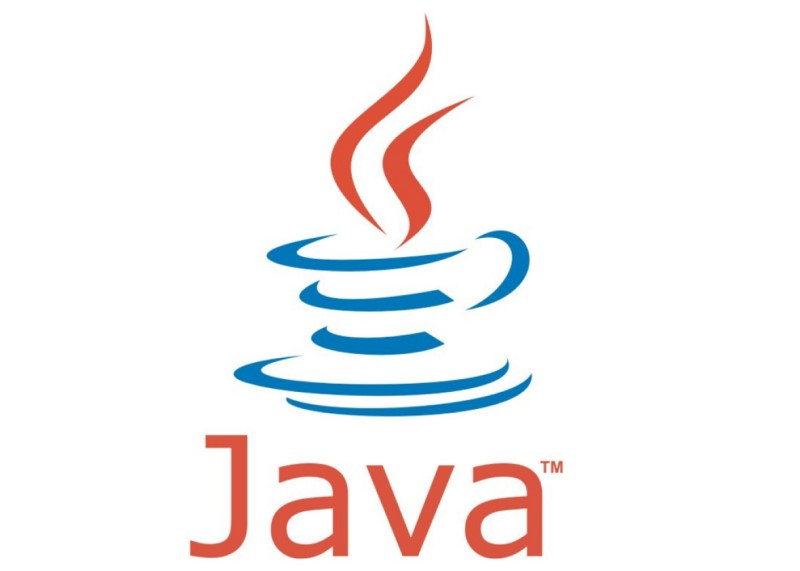

# [STS-10] 웹프로그래밍 :: 짧고 굵게 배우기

[![Dinfree][din-badge]][din-url]
[![Subject][basic-badge]][din-url]

[STS-10]은 웹프로그래밍의 핵심 개념에서 부터 주요 기술인 html, css, javascript를 비롯해 필수 응용 라이브러리인 bootstrap, jquery까지를 다루는 과정 입니다.

 ## 개발 도구 설치
JDK, eclipse, mySQL, tomcat, Visual Studio Code 개발도구를 설치하는 방법입니다.
### 목차
1. [JDK](#m1)
2. [eclipse](#m2)
3. [mySQL](#m3)
4. [tomcat](#m4)
5. [Visual Studio Code](#m5)

---

## 1. JDK

JDK는 Java Development Kit 말 그대로 자바 개발을 위한 도구입니다. 자바 컴파일러(Javac), 자바가상머신(JVM), 각종 Java Libary 등을 포함하고 있어서 자바 개발을 위한 필수 도구(Kit) 입니다. JDK는 JRE를 포함하고 있습니다.

**설치 url** : java.oracle.com

### 동영상 강좌
- Java - 설치와 실행 2 : 윈도우에 Java 설치하기
  > https://bit.ly/2BNUSLH `09:19`

---

## 2. eclipse

이클립스는  다양한 플랫폼에서 쓸 수 있으며, 자바를 비롯한 다양한 언어를 지원하는 프로그래밍 통합 개발 환경을 목적으로 시작하였으나, 현재는 OSGi를 도입하여, 범용 응용 소프트웨어 플랫폼으로 진화하였습니다. 자바로 작성되어 있으며, 자유 소프트웨어이지만 막강한 기능을 자랑합니다.

**설치 url** : eclipse.org

### 동영상 강좌
- Java - 이클립스의 설치방법 - 윈도우
  > https://bit.ly/2MBSnBe `02:41`

---

## 3. mySQL

MySQL은 세계에서 가장 많이 쓰이는 오픈 소스의 관계형 데이터베이스 관리 시스템(RDBMS) 입니다. 다중 스레드, 다중 사용자 형식의 구조질의어 형식의 데이터베이스 관리 시스템으로서 MySQL AB가 관리 및 지원하고 있으며, Qt처럼 이중 라이선스가 적용됩니다. 하나의 옵션은 GPL이며, GPL 이외의 라이선스로 적용시키려는 경우 전통적인 지적재산권 라이선스의 적용을 받습니다.

**설치 url**: mysql.com

---

## 4. tomcat

아파치 톰캣은 아파치 소프트웨어 재단에서 개발한 서블릿 컨테이너만 있는 웹 애플리케이션 서버입니다. 톰캣은 웹 서버와 연동하여 실행할 수 있는 자바 환경을 제공하여 자바 서버 페이지와 자바 서블릿이 실행할 수 있는 환경을 제공하고 있습니다. 톰캣은 관리툴을 통해 설정을 변경할 수 있지만, XML 파일을 편집하여 설정할 수도 있습니다. 그리고, 톰캣은 HTTP 서버도 자체 내장하기도 합니다.

**설치 url** : tomcat.apache.org

---

## 5. Visual Studio Code

비주얼 스튜디오 코드는 마이크로소프트가 마이크로소프트 윈도우, macOS, 리눅스용으로 개발한 소스 코드 편집기입니다. 디버깅 지원과 Git 제어, 구문 강조 기능등이 포함되어 있으며, 사용자가 편집기의 테마와 단축키, 설정 등을 수정할 수 있습니다. 비주얼 스튜디오 코드는 깃허브가 개발한 일렉트론 프레임워크를 기반으로 구동됩니다. 그러나 같은 일렉트론 기반의 편집기 아톰을 포크한 것은 아니며, 비주얼 스튜디오 온라인 에디터를 기반으로 개발되었습니다. 

비주얼 스튜디오 코드는 가볍고, 플러그인 개발이 쉬운 장점이 있으며, 마이크로소프트의 지원을 받고있다는 장점을 가지고 있습니다.

추천 플러그인에는 github, Markdown preview, open in browser 등이 있습니다. 

#### 플러그인 설치 방법

1. 왼쪽 배너에서 마지막 아이콘을 누르면 Extensions 창이 뜹니다. 
2. 설치하고 싶은 플러그인을 검색을 하여 install을 클릭합니다.
---

[din-badge]:https://img.shields.io/badge/dinfree-edu-orange.svg
[din-url]:https://github.com/dinfree
[basic-badge]:https://img.shields.io/badge/core-basic-green.svg
