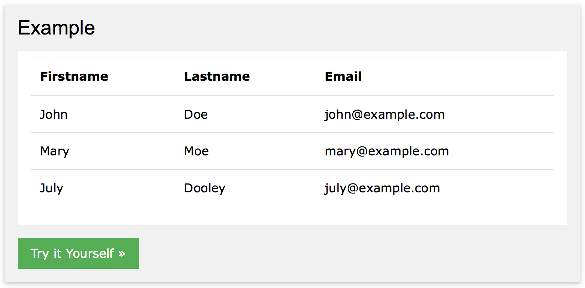

# [STS-10] 웹프로그래밍 :: 짧고 굵게 배우기

[![Dinfree][din-badge]][din-url]
[![Subject][basic-badge]][din-url]

[STS-10]은 웹프로그래밍의 핵심 개념에서 부터 주요 기술인 html, css, javascript를 비롯해 필수 응용 라이브러리인 bootstrap, jquery까지를 다루는 과정 입니다.

## 공통: 컴퓨터 초보를 위한 기초 학습
이부분은 해당 챕터에 대한 설명과 안내가 나와야 하는데 우선 이부분은 비워 두도록 한다. 이부분은 해당 챕터에 대한 설명과 안내가 나와야 하는데 우선 이부분은 비워 두도록 한다.이부분은 해당 챕터에 대한 설명과 안내가 나와야 하는데 우선 이부분은 비워 두도록 한다.이부분은 해당 챕터에 대한 설명과 안내가 나와야 하는데 우선 이부분은 비워 두도록 한다.이부분은 해당 챕터에 대한 설명과 안내가 나와야 하는데 우선 이부분은 비워 두도록 ::한다::.

### 목차
1. 컴퓨터와 운영체제
2. 파일 관리
3. cmd 사용법
4. 크롬 웹브라우저

---
## 1. 컴퓨터와 운영체제
소제목에 대한 간단한 설명이 와야 합니다. 최대한 간결하게 해당 소제목의 내용중 핵심을 설명합니다. 설명과 함께 목록등이 올 수 있으며 반드시 하나 이상의 이미지와 설명이 있어야 합니다. 단, 내용이 너무 길어지지 않도록 작성 합니다.



이런식으로 이미지를 넣고 또 필요하다면 중간중간에 `강조할부분` 을 작성하고 강조텍스트 등을 사용하고 목록을 사용 합니다.
- 목록1을 반드시 알아 함.
- 목록2는 00을 말한.
- 00와 000은 서로 다르면 어쩌구 저쩌구 함.

### 동영상 강좌
- 제목을 작성 합니다.
  > URL을 작성 합니다. (부분시간의 경우 표시)
- 제목을 작성 합니다.
  > URL을 작성 합니다. (부분시간의 경우 표시)
- 제목을 작성 합니다.
  > URL을 작성 합니다. (부분시간의 경우 표시)

### 참고 자료
> pdf, ppt, slideshare, 관련정보사이트 등 충분하게. 영상과 마찬가지로 추후 설명이 추가 되어야 함.
- 제목: url
- 제목: url

### 퀴즈
#### 1) 000은 000이 아니고 XXX 입니까?
<details>
<summary>해답보기</summary>
<p></p>
<div markdown="1">

```java
Hello Java
```
</div>

</details>

#### 2) 000은 000이 아니고 XXX 입니까?
<details>
<summary>해답보기</summary>
<p></p>
<div markdown="1">

```java
Hello Java
```
</div>

</details>

## 2. 파일관리

## 3. cmd 사용법

## 4. 크롬 웹브라우저


[din-badge]:https://img.shields.io/badge/dinfree-edu-orange.svg
[din-url]:https://github.com/dinfree
[basic-badge]:https://img.shields.io/badge/core-basic-green.svg
