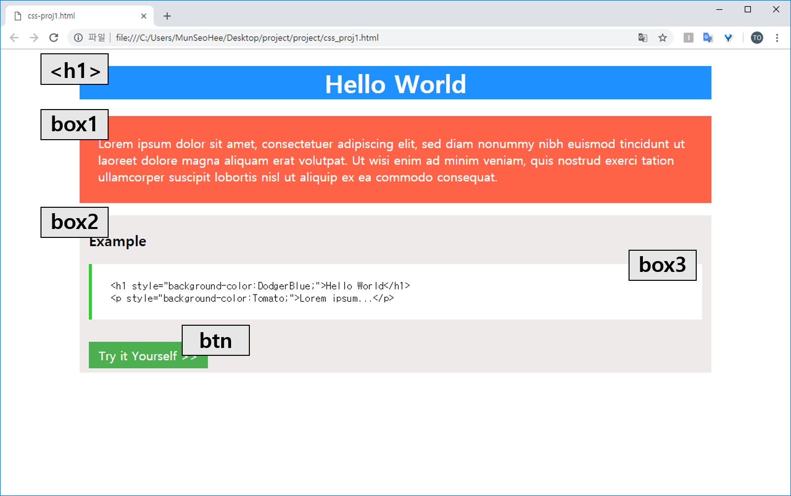
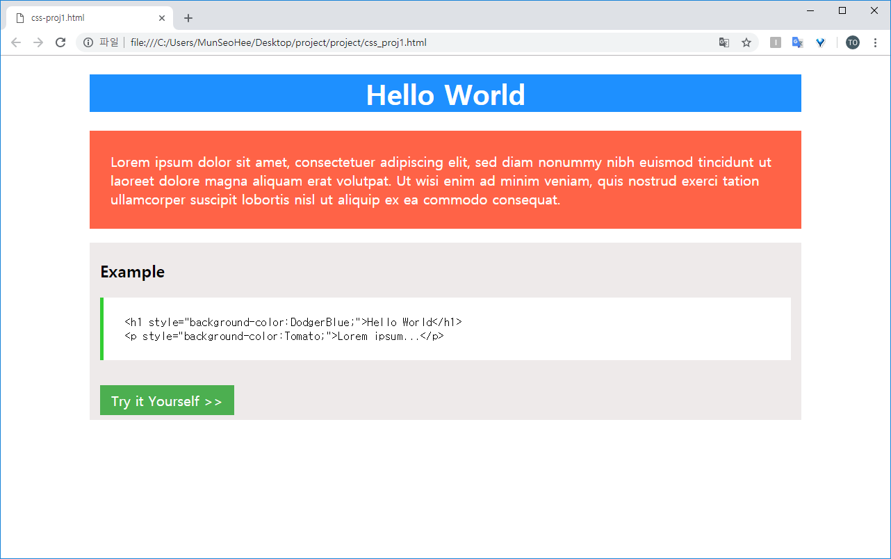
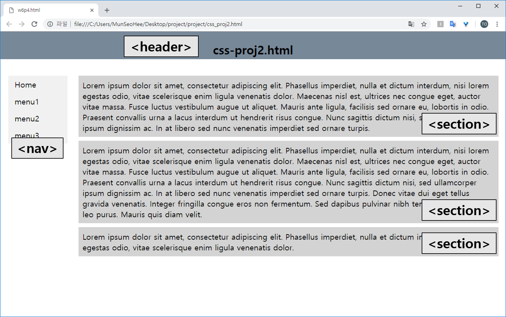
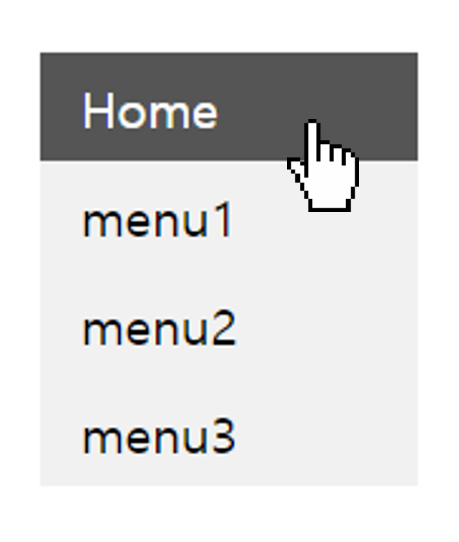
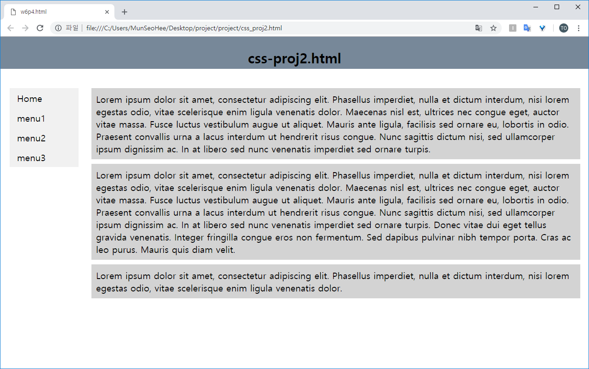
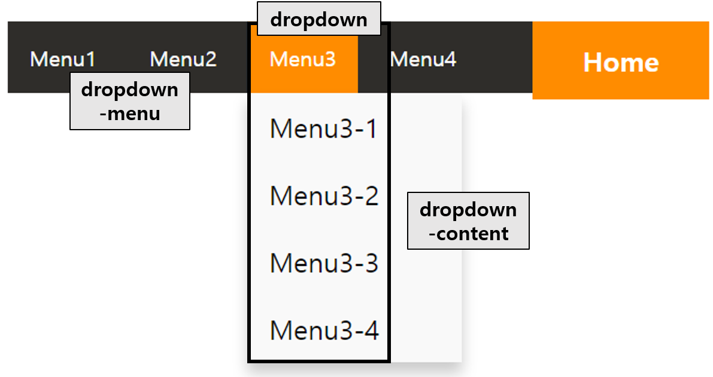
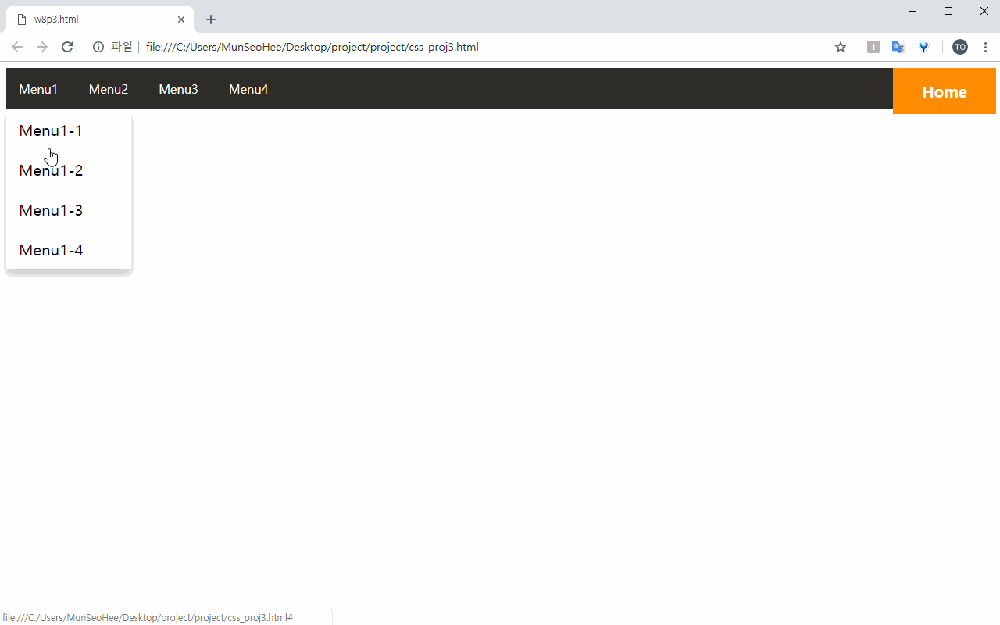

<p id="m1"></p>
### 01. 박스 모델
본 예제에서는 박스 모델의 이해를 도울 수 있는 사이트를 제작해봅니다. 


### step-1> 구조 분석
아래와 같은 페이지를 제작하기 전에 페이지의 구조를 분석합니다. 
- 가장 상단에 위치한 'Hello World'라고 적힌 `<h1>` 박스 
- `<div>` 태그로 이루어진 `box1`
- `<div>` 태그로 이루어진 `box2`
- box2의 내부 :  `<xmp>`태그로 이루어진 `<box3>` 및 `<span>`태그로 이루어진 `<btn>` 버튼




### step-2> HTML 기본 구조 작성
기본적인 구조를 잡기위해 html을 이용하여 아래와 같이 코드를 작성합니다. 
- `<h1>`태그 아래 `<div>`태그를 사용하여 두 개의 박스를 만들어줍니다. 
- 각각은 box1, box2라는 class 이름을 지정합니다. 
- box2 안에는 코드를 그대로 출력해주는 `<xmp>`태그를 이용하여 box3과 `<span>`태그를 이용하여 버튼(btn)을 만들어줍니다. 

```html
<H1>Hello World</H1>
<div class="box1">
</div>
<p></p>
<div class="box2">
    <xmp class="box3">
    </xmp>
    <br>
    <span class="btn"></span>
</div>
```

### step-3> 내용 작성
내용을 채워넣기 위해 아래와 같이 코드를 작성합니다. 
- box1의 내용의 경우 `Lorem`이라 작성 후 엔터 혹은 Tab키를 누를 경우 자동적으로 텍스트가 작성됩니다. 

```html
<H1>Hello World</H1>
<div class="box1">
    Lorem ipsum dolor sit amet, consectetuer adipiscing elit, sed diam nonummy nibh euismod tincidunt ut laoreet dolore magna aliquam erat volutpat. Ut wisi enim ad minim veniam, quis nostrud exerci tation ullamcorper suscipit lobortis nisl ut aliquip ex ea commodo consequat.
</div>
<p></p>
<div class="box2">
    <H3>Example</H3>
    <xmp class="box3">
<h1 style="background-color:DodgerBlue;">Hello World</h1>
<p style="background-color:Tomato;">Lorem ipsum...</p>
    </xmp>
    <br>
    <span class="btn">Try it Yourself >></span>
</div>
```

### step-4> h1 스타일 추가
h1 태그에 스타일을 추가하기 위해 아래와 같이 코드를 입력합니다. 
- text-align : 텍스트의 정렬 방향을 의미하는 속성입니다. 값으로 `centet`을 주어 중앙 정렬를 합니다.
- background-color : 배경 색을 지정하는 속성입니다.
- color : 글자 색을 지정하는 속성입니다.

```css
h1 {
        background-color: dodgerblue;
        color: white;
        text-align: center;
    }
```

### step-5> box1 스타일 추가
box1에 스타일을 추가하기 위해 아래와 같이 코드를 입력합니다.
- .box1 : 클래스명인 box1을 선택자로 선택합니다. 클래스를 선택자로 사용할 경우 `.클래스명`과 같이 사용합니다.
- padding : 안쪽 여백을 의미합니다. 보기 좋은 박스를 만들기위해 아래와 같이 적절한 여백 값을 부여하여, 텍스트와 박스 사이에 간격이 생기도록 합니다.

```css
.box1 {
        background-color: tomato;
        color: white;
        padding: 30px 30px;
    }
```

### step-6> box2 스타일 추가
선택자로서 클래스명 box2를 선택하여 스타일을 추가하기 위해 아래와 같이 코드를 입력합니다. 배경색을 변경하고 패딩값을 주어 텍스트를 둘러싼 박스에 안쪽 여백을 부여합니다.
- 색상과 관련된 속성의 값으로 rgb색상을 이용할 수 있습니다.

```css
.box2 {
        background-color:rgb(238, 234, 234);
        padding: 2px 15px 15px 15px;
    }
```

### step-7> box3 스타일 추가
선택자로서 클래스명 box3을 선택하여 스타일을 추가하기 위해 아래와 같이 코드를 입려합니다. 배경색을 하얀색으로 변경하고 패딩값을 주어 텍스트를 둘러싼 박스에 안쪽 여백을 부여합니다.
- border-left : border은 테두리를 설정하는 속성입니다. boder-left는 왼쪽 테두리를 의미하며, `5px solid limegreen`은 각각 테두리 굵기, 실선 테두리, 테두리의 색상을 의미합니다.

```css
.box3 {
        background-color:white;
        padding: 5px 5px;
        border-left: 5px solid limegreen;
    }
```

### step-8> 버튼 스타일 추가
버튼의 스타일을 추가하기 위해 아래와 같이 코드를 입력합니다. 버튼을 선택하기위해 클래스 명 `.btn`을 선택자로 하여, 배경색과 글자색의 스타일을 변경하고 패딩값을 적용하여줍니다.
- 색상과 관련된 속성의 값으로 `#FFFFFF`, `#000`등의 16진수 색상코드를 이용할 수 있습니다.

```css
.btn {
        background-color:#4CAF50;
        color: white;
        padding: 8px 16px;
    }
```

### step-9> 전체적인 크기 조정
전체적인 크기를 조절하기 위한 스타일을 적용하기위해 아래와 같이 코드를 입력합니다.
- body : 전체적인 변경을 위하여 모든 태그를 감싸고 있는 `<body>`태그를 선택자로 두어 스타일을 지정합니다.
- width : 너비를 설정하는 속성입니다. 기본적으로 전체 화면의 너비만큼의 크기를 가지게 됩니다. 값을 80%정도로 부여하여 전체 화면의 80% 정도의 너비를 가지도록하여 좌우에 적당한 여백을 가지도록 합니다.
- margin : 바깥쪽 여백을 의미합니다. margin을 auto로 설정하여 중앙에 위치하도록 할 수 있습니다.

```css
body {  
        width: 80%;
        margin: auto;
    }
```

### step-10> 실행결과 확인
브라우저에서 실행결과를 확인 합니다.




---
<p id="m2"></p>
### 2. 레이아웃
본 예제에서는 기본적인 레이아웃 틀을 구성하는 방법을 알아봅니다. 레이아웃에 대해 이해하고 `header`와 `nav` 및 `section`으로 화면을 구성해 봅니다. 


### step-1> 레이아웃
아래 이미지는 본 예제에서 최종적으로 만들고자하는 사이트입니다. 
- header와 nav 및 3개의 section으로 이루어져 있습니다. 
- 웹페이지의 서로다른 부분을 정의하는 시멘틱 요소들을 사용합니다. 
- 시멘틱 요소에서 `<header>`는 문서 또는 섹션의 머리글을 정의합니다. 
- 시멘틱 요소에서 `<nav>`는 탐색 링크에 대한 컨테이너 정의를 합니다.
- 시멘틱 요소에서 `<section>`은 문서의 섹션을 정의합니다. 
- 본 예제에서는 사용되지 않지만, 그 외의 시멘틱 요소로는 section의 하위 요소로 분류되며 실질적인 내용이 들어가는 `<article>`과 본문 이외의 내용을 담고있는 사이드바인 `<aside>`, 가장 하단에 위치하는 `<footer>`등이 있습니다.




### step-2> HTML 기본 구조 작성
html로 기본 구조를 잡아주기위해 아래와 같이 코드를 입력합니다. 
- `<header>`와 `<nav>`, `<section>` 시맨틱 태그를 이용하여 레이아웃을 잡아줍니다. 
- header태그 내부에는 문서의 제목을 나타내기위해 h태그를 사용합니다.
- nav태그 내부에는 navbar를 만들기위해 list태그를 사용합니다. 
- section은 총 3개로 구성합니다. section 내용의 경우 위의 예제와 같이 Lorem 입력 후 탭 혹은 엔터를 통해 자동 입력을 할 수 있습니다. 

```html
<header>
        <H2>css-proj2.html</H2>
</header>

<HR>
<div class="container">
    <nav>
        <ul>
            <li><a href="#">Home</a></li>
            <li><a href="#">menu1</a></li>
            <li><a href="#">menu2</a></li>
            <li><a href="#">menu3</a></li>            
        </ul>
    </nav>                
    <section>
            Lorem ipsum dolor sit amet, consectetur adipiscing elit. Phasellus imperdiet, nulla et dictum interdum, nisi lorem egestas odio, vitae scelerisque enim ligula venenatis dolor. Maecenas nisl est, ultrices nec congue eget, auctor vitae massa. Fusce luctus vestibulum augue ut aliquet. Mauris ante ligula, facilisis sed ornare eu, lobortis in odio. Praesent convallis urna a lacus interdum ut hendrerit risus congue. Nunc sagittis dictum nisi, sed ullamcorper ipsum dignissim ac. In at libero sed nunc venenatis imperdiet sed ornare turpis.
    </section>
    <section>
            Lorem ipsum dolor sit amet, consectetur adipiscing elit. Phasellus imperdiet, nulla et dictum interdum, nisi lorem egestas odio, vitae scelerisque enim ligula venenatis dolor. Maecenas nisl est, ultrices nec congue eget, auctor vitae massa. Fusce luctus vestibulum augue ut aliquet. Mauris ante ligula, facilisis sed ornare eu, lobortis in odio. Praesent convallis urna a lacus interdum ut hendrerit risus congue. Nunc sagittis dictum nisi, sed ullamcorper ipsum dignissim ac. In at libero sed nunc venenatis imperdiet sed ornare turpis. Donec vitae dui eget tellus gravida venenatis. Integer fringilla congue eros non fermentum. Sed dapibus pulvinar nibh tempor porta. Cras ac leo purus. Mauris quis diam velit.
    </section>
    <section>
            Lorem ipsum dolor sit amet, consectetur adipiscing elit. Phasellus imperdiet, nulla et dictum interdum, nisi lorem egestas odio, vitae scelerisque enim ligula venenatis dolor.
    </section>
</div>
```


### step-3> header 스타일 적용
header부분의 스타일을 적용하기위해 다음과 같이 코드를 입력합니다.
- header부분의 스타일 적용을위해 선택자로서 시맨틱 태그인 `header`를 선택합니다. 
- position : 태그를 어떻게 위치시킬지를 정의합니다. 값으로 fixed를 부여할 경우 스크롤과 상관없이 항상 문서 최 좌측상단을 기준으로 좌표를 고정시킵니다. 
- top, left : 좌표를 지정해주기 위한 속성입니다. 최 좌측 상단을 기준으로한 좌표를 지정합니다.
- z-index : position 속성을 지정하다보면 태그들이 겹치게 될 수 있습니다. 이럴 경우, z-index 속성을 이용하여 더 위에 배치시키거나 더 아래에 배치시킬 수 있습니다. 값이 높을 수록 위쪽에 배치되게 됩니다. header을 가장 위쪽에 보여지도록 하기위에 해당 속성을 적용시켜줍니다. 
- width : 값을 100%로 부여하여 화면의 너비만큼의 가로길이를 가지도록 합니다. 

```css
header {
        text-align: center;
        z-index: 1;
        position: fixed;
        top: 0;
        left: 0;
        height: 70px;
        background-color: lightslategrey;
        width: 100%;
    }
```

### step-4> nav 스타일 적용
nav 부분의 스타일을 변경하고 list의 스타일을 변경하여 navbar를 만들어봅니다. 
- list의 각 요소인 a태그를 일렬로 배치시킨 뒤, a태그와 list에 기본적으로 적용되는 스타일을 제거합니다. 크기와 배경색 등을 지정하여  nav bar 모양을 잡아주고, fixed로 위치를 고정하여 nav bar를 만듭니다.
- nav : nav를 선택자로하여 position 속성을 이용해 좌측상단을 기준으로 위치를 고정시킵니다. left 속성을 주어 왼쪽으로부터 20px만큼 떨어진 곳에 위치하게 합니다.
- list-style-type : 리스트 항목 모양의 종류를 지정하는 속성입니다. 값으로 none을 줄 경우 항목 표시가 되지 않습니다.
- li a : 부모 자식 선택자로서, 태그 이름 사이에 공백을 넣을 경우 부모태그(왼쪽) 하위에 있는 자식태그(오른쪽)에 스타일을 적용시킵니다.
- display : 요소를 어떻게 보여줄지를 결정합니다. block은 해당 태그를 가로가 기본적으로 100%의 공간을 차지하는 블록 박스로 변경합니다. 다음과 같이 속성을 적용하여 a태그가 일렬로 자리하게 만듭니다.
- text-decoration : 글자에 밑줄을 넣는 속성입니다. none으로 값을 줄 경우 밑줄이 없어지게됩니다. a태그의 경우 기본적으로 글자 아래에 밑줄이 있기 때문에, 다음과 같이 속성 값을 주어 밑줄을 제거해줍니다.
 


```css
nav {
    position: fixed;
    left: 20px;
}

ul {
    list-style-type: none;
    margin: 0;
    padding: 0;
    width: 150px;
    background-color: #f1f1f1;
}

li a {
    display: block;
    color: #000;
    padding: 8px 16px;
    text-decoration: none;
}
```

### step-5> navbar hover 속성 추가
마우스가 올라갔을 때 스타일이 변경되는 hover 속성을 추가하기위해 아래와 같이 코드를 작성합니다. 
- hover : 마우스가 올려져있는 상태에 대한 셀렉터로, 마우스가 올라갔을 때 주어진 속성 값들로 스타일이 변경되게 됩니다.

```css
li a:hover {
    background-color: #555;
    color: white;
}
```




### step-6> section 스타일 적용
section의 스타일을 적용하기 위해 다음과 같이 코드를 입력합니다. 
- section부분의 스타일 변경을 위해 시맨트 태그인 `section`을 선택자로 지정합니다.
- margin-top, margin-left : 바깥쪽 여백을 지정하는 margin에서 margin-top은 상단부분의 margin만을, margin-left는 좌측부분의 margin만을 지정하는 속성입니다. 다음과 같이 속성을 적용하여 section 간의 간격과 nav와의 간격을 넓혀줍니다. 

```css
section {
    margin-left: 180px;
    background-color: lightgray;
    padding: 10px;
    margin-top: 10px;
}
```


### step-7> container 위치 조정
nav와 section을 묶고 있는 container의 위치를 조절하기위해 다음과 같이 코드를 입력합니다. 
- container은 nav와 section을 감싸고 있는 div 태그의 클래스명입니다. nav와 section의 위치를 조절하기 위해 container을 선택자로 지정합니다.
- margin : 상하 100px와 좌우 10px의 여백을 부여합니다. header의 아래로 겹쳐져 있는 container을 아래로 내리고, 좌우에 약간의 여백을 부여하여 보기 좋게 만듭니다. 

```css
.container {
    margin: 100px 10px;
}

body {
    margin-bottom: 120px;
}
```

### step-8> 실행결과 확인
브라우저에서 실행결과를 확인 합니다.




---
<p id="m3"></p>
### 3. drop down navbar 구현하기
본 예제에서는 html과 css를 이용하여 마우스가 올라가면 스타일이 변경되는 hover 효과 및 마우스를 올릴 경우 하위 메뉴가 나오는 drop down 효과가 적용된 navbar를 만들어봅니다. 


### step-1> HTML 기본 구조 작성
html로 기본 구조를 잡아주기위해 아래와 같이 코드를 입력합니다. 
- nav bar를 의미하는 nav 시맨틱 태그 아래 nav bar를 만들기 위해 리스트인 ul 태그로 구성되어있습니다. li 태그들에는 각각의 드롭다운 상하위 항목들로 구성합니다. 
- dropdown-menu : 드롭다운의 상위 항목들은 클래스명이 dropdown-menu인 div태그로 묶어줍니다.
- dropdown-content : 드롭다운의 하위 항목들은 클래스명이 dropdown-content인 div태그로 묶어줍니다. 각각의 하위 항목들은 클릭시 특정 페이지로 이동할 수 있도록 a태그로 작성합니다.
- dropdown : 하나의 상위와 하위 항목들을 클래스명이 dropdown인 div태그로 묶어줍니다. 하나의 상하위 항목들은 li태그로 구성됩니다. 
- home : 하위 항목이 펼쳐지는 드롭다운이 아니기 때문에 dropdown 클래스로 묶지 않습니다. 클릭시 home 화면으로 돌아오는 버튼이기 때문에, a태그로 구성하고 home이라는 클래스명을 부여합니다.

```html
<body>
    <nav>
        <ul>
            <li>
                <div class="dropdown">
                    <div class="dropdown-menu">Menu1</div>
                    <div class="dropdown-content">
                        <a href="#">Menu1-1</a>
                        <a href="#">Menu1-2</a>
                        <a href="#">Menu1-3</a>
                        <a href="#">Menu1-4</a>
                    </div>
                </div>
            </li>
            <li>
            <div class="dropdown">
                <div class="dropdown-menu">Menu2</div>
                <div class="dropdown-content">
                    <a href="#">Menu2-1</a>
                    <a href="#">Menu2-2</a>
                    <a href="#">Menu2-3</a>
                    <a href="#">Menu2-4</a>
                </div>
            </div>
            </li>
            <li>
            <div class="dropdown">
                <div class="dropdown-menu">Menu3</div>
                <div class="dropdown-content">
                    <a href="#">Menu3-1</a>
                    <a href="#">Menu3-2</a>
                    <a href="#">Menu3-3</a>
                    <a href="#">Menu3-4</a>
                </div>
            </div>
            </li>
            <li>
            <div class="dropdown">
                <div class="dropdown-menu">Menu4</div>
            </div>
            </li>
            <li><a class="home" href="#">Home</a></li>
        </ul>
    </nav>
</body>
```


### step-##> nav bar 만들기1
- 목록을 나타내는 ul 태그를 선택하여 list 항목 스타일을 없애고, 너비를 화면의 전체로 지정합니다. 배경색과 안쪽, 바깥쪽 여백을 부여하여 nav bar의 기본 배경을 만듭니다.
- 마진 패딩 지정하지 않으면 브라우저 기본 스타일을 따라 설정되므로 재정의 해주는 것이 필요합니다. 

```css
nav ul {
    width: 100%;
    background-color: rgba(44, 42, 39, 0.983);
    list-style-type: none;
    margin: 0;
    padding: 0;
}
```

### step-2> nav bar 항목 배치
nav bar의 각 항목들을 일렬로 배치하기 위해 다음과 같이 코드를 작성합니다. 
- inline-block : 블록 박스와 인라인 박스의 중간 형태를 의미합니다. 줄바꿈이 되지 않지만 크기를 지정할 수 있는 형태입니다. 인라인 속성을 부여하여 각 항목들이 나란히 배치될 수 있도록 합니다. 

```css
nav ul li {
    display: inline-block;
}
```

### step-3> nav bar 하위 항목 배치
nav bar의 하위 항목들을 일렬로 배치하기 위해 다음과 같이 코드를 작성합니다.
- display : block으로 속성 값을 주어 각각의 하위 항목들이 블록 박스의 속성을 부여합니다. 각 요소들이 줄바꿈이 되어 일렬로 배치되게 됩니다. 
- text-decoration : a태그는 글자에 기본적으로 밑줄이 표기되기 때문에, none으로 속성값을 주어 밑줄을 제거합니다.
- display로 block 속성을 부여했다고 하여도, a 는 기본적으로 인라인 요소이기 때문에 width, height 는 적용되지 않습니다. 따라서 padding 을 이용해 크기 지정합니다.

```css
nav ul li a {
    display: block;
    text-decoration: none;
    color: white;
    padding: 16px 16px;
}
```
### step-4> home 배치
home만 우측에 배치하기 위해 다음과 같이 코드를 작성합니다.
- float : '뜨다'라는 의미이며, 객체를 어떻게 띄어서 문서의 어느곳에 배치할 것인지를 지정합니다. 속성 값으로 left,right, none 밖에 없으며 right로 지정할 경우 오른쪽으로 띄우게 됩니다.

```html
<li style="float: right;"><a class="home" href="#">Home</a></li>
```

### step-5> home 스타일 변경
home의 스타일을 변경하기 위해 선택자로서 클래스 home을 지정합니다. 크기를 조정하고 배경색을 변경한 뒤 글자를 중앙으로 정렬하고 굵게 만들어 모양을 만듭니다. 
- font-weight : 글자의 굵기를 지정하는 속성입니다. 값으로 bold를 줄 경우, 글씨의 굵기가 굵어지게됩니다.

```css
.home {
    background-color: darkorange;
    width: 100px;
    text-align: center;
    font-weight: bold;
}
```

### step-6> nav bar 상위 항목 스타일 변경
기본적으로 nav bar에 보여지는 상위 항목(메뉴)을 만들기위해 다음과 같이 코드를 작성합니다.
- 글자색과 글자 크기를 바꾸고, padding을 이용하여 크기를 적절하게 조정합니다.
- cursor : 해당 태그 위에 위치하는 마우스 커서의 모양을 바꿀 수 있습니다. 값으로 pointer가 주어질 경우, 클릭 가능한 버튼에 나타나는 손가락 모양으로 변하게 됩니다. 마우스가 다가갈 경우 drop down 으로 하위 항목이 나타나야되므로, 마우스의 모양을 바꾸어줍니다.

```css
.dropdown-menu {
    color: white;
    padding: 16px;
    font-size: 16px;
    cursor: pointer;
}
```


### step-7> nav bar 하위 항목 스타일 변경
상위 항목에 커서를 올렸을 경우, drop down으로 보여지는 부분이 하위 항목을 만들기 위해 다음과 같이 코드를 작성합니다.
- absolute : 절대 좌표와 함께 원하는 위치에 배치시키는 방법입니다. 가장 가까운 부모 요소의 위치를 기준으로 배치되게 됩니다. 상위 항목과의 위치가 어긋나면 안되므로, 가까운 부모 요소인 dropdown을 기준으로 위치가 고정되도록 합니다.
- min-width : 최소 너비를 지정합니다. width를 100px로 설정했더라도, min-width가 160px라면 160px이하로 작아지지 않습니다. 
- box-shadow : 박스 요소에 그림자를 넣는 속성입니다. `0px 8px 16px 0px rgba(0,0,0,0.2)`의 값은 앞에서부터 차례대로 `수평 그림자 위치`, `수직 그림자 위치`, `그림자의 흐림 정도`, `그림자가 드리워지는 정도`, `그림자 색깔`을 의미합니다. dropdown-content에 그림자 속성을 넣어주어, 하위 항목들을 감싸고 있는 박스에 그림자 효과가 추가되도록 합니다.
- a 태그는 기본적으로 인라인 속성을 가지고 있기 때문에, display : block이라는 속성과 값을 넣어주어 블록 속성을 가지도록하여 일렬로 배치되게 합니다.

```css
.dropdown-content {
    position: absolute;
    background-color: #f9f9f9;
    min-width: 160px;
    box-shadow: 0px 8px 16px 0px rgba(0,0,0,0.2);
}

.dropdown-content a {
    color: black;
    padding: 12px 16px;
    text-decoration: none;
    display: block;
}   
```

### step-8> 하위항목 숨기기
drop down에서는 마우스 커서가 올라가기 전까지 하위 항목들은 화면에 보여지지 않습니다. 이와 같이 하위 항목들이 기본적으로는 화면에 보여지지 않게 하기 위하여 display 속성을 추가합니다.
- display : 요소를 어떻게 보여줄지를 결정하는 속성입니다. 값으로 none이 주어질 경우 보이지 않게 됩니다.

```css
.dropdown-content {
    display: none;
}
```

### step-9> hover 효과 넣기
태그에 마우스가 올라갔을 때를 hover라고 합니다. 마우스가 nav bar의 상위 항목에 올라갈 경우, 해당 항목의 스타일이 변경되는 효과를 넣기 위해 다음과 같이 코드를 작성합니다.
- hover : hover은 가상클래스의 일종입니다. `요소:hover`같은 식으로 사용하며, :hover 앞에 있는 요소에 마우스 커서가 올라갈 경우 속성이 변경됩니다. 예제 코드의 경우 클래스 `dropdown-menu`에 커서가 올라갈 경우 hover가 되도록 작성되어있습니다. 
- not(.home) : not은 부정 가상클래스 라고합니다. `:not(선택자)`의 형식으로 사용하며, 선택자가 아닌 곳에 스타일을 변경하게됩니다. 예제 코드의 경우 클래스 `home`이 아닐 경우를 의미합니다.
- .dropdown-menu:hover:not(.home) : 클래스 `home`이 아닌 클래스 `dropdown-menu`에 `hover`되었을 경우 지정한 스타일에 따라 변경되도록 합니다. 

```css
.dropdown-menu:hover:not(.home){
    background-color: darkorange;
    color: white;
}
```

### step-10> drop down 만들기
마우스 커서가 올라갈 경우, 해당 항목의 하위 항목들이 아래로 펼쳐지는 drop down을 만들기 위해 다음과 같이 코드를 작성합니다.
- .dropdown:hover .dropdown-content : 두 요소 사이에 공백이 있을 경우 좌측(부모 요소)의 자손인 우측(자식 요소)를 선택하게 됩니다. 예제 코드에서는 .dropdown:hover은 부모 요소, .dropdown-content은 자식 요소가 됩니다. 즉, hover가 된 상위 항목의 하위 항목들을 의미하게 됩니다.
- display : step-8에서 display:none으로 하위 항목들을 보이지 않게 만들었습니다. 해당 항목들을 보이도록 하기위해 display 속성을 다시금 적용하여 오버라이딩 되도록 합니다.

```css
.dropdown:hover .dropdown-content {
    display: block;
}
```

### step-11> 하위 항목 hover 효과 넣기
하위 항목들의 각 요소들에 마우스 커서가 올라갈 경우, 해당 요소의 스타일이 변경되도록 하기위해 다음과 같이 코드를 작성합니다.
- .dropdown-content a:hover : 클래스 dropdown-content의 자식 요소인 a태그 중 hover가 된 a태그를 선택자로 두어 스타일을 변경시킵니다. 

```css
.dropdown-content a:hover {background-color: #f1f1f1}
```

### step-12> 실행결과 확인
브라우저에서 실행결과를 확인 합니다.


