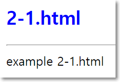
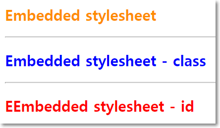
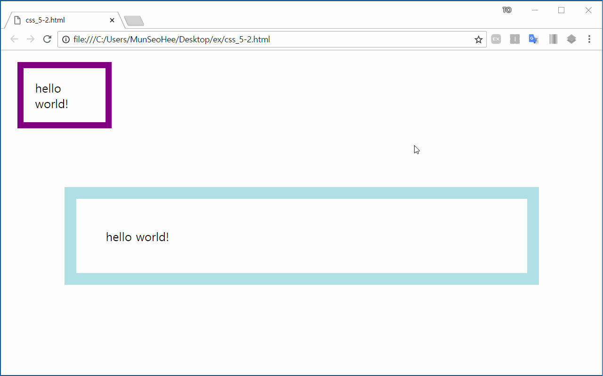

# [STS-121 실습] 웹 프론트엔드 개발 기초::HTML

[![Dinfree][din-badge]][din-url]
[![Subject][html-badge]][din-url]
[![Subject][css-badge]][din-url]
[![Subject][js-badge]][din-url]

## 시작하기 전에
이 페이지는 프론트엔드 웹 프로그래밍의 기본이 되는 [STS-121] HTML 기초 강좌의 예제 학습 페이지 입니다. 동영상이 포함된 강좌는 [STS-121][] 에서 보실수 있습니다. 이곳에서는 각 챕터별 예제들과 간단한 프로젝트형식의 종합예제를 정리해서 제공하고 있습니다. 각각의 예제는 github 리파지토리에서 받아가실수 있으며 첨부된 설명에 따라 학습을 진행하면 됩니다. 실습을 위한 모든 환경설정은 `공통기초->[STS-103]개발도구` 에서 다루었습니다. 따라서 해당학습을 진행하지 않았다면 반드시 먼저 살펴보고 실습을 진행하기 바랍니다.

### 목차
1. [css 개념 이해](#index1)
2. [기본 문법과 포함 방법](#index2)
3. [셀렉터 기초](#index3)
4. [컬러, 배경색 지정하기](#index4)
5. [css 단위, 박스모델](#index5)
6. [복합셀렉터](#index6)
7. [레이아웃, 정렬, 인라인블럭](#index7)

--- 
<a id="index1"></a>
## 1. css 개념 이해
### 예제 1-1) css 사용 이유
본 예제에서는 css를 사용하는 이유를 알아보기 위해 웹 페이지의 소스코드 저장하여 html로만 이루어진 사이트와 css가 적용된 사이트를 비교하여봅니다.

#### step-1> 웹브라우저 실행하여 url 입력하기
```
웹 브라우저를 실행하고 상단의 URL 창에 다음 주소를 입력하고 엔터를 칩니다.
- http://www.naver.com
```
#### step-2> 소스 코드 다운받기
```
웹 브라우저 화면에서 오른쪽 버튼을 눌러 다른 이름으로 저장을 선택하여 적당한 곳에 저장합니다.
```


#### step-3> 파일 열기
```
저장을 한 폴더에 가서 확인을 해보면 NAVER_files과 NAVER.html 두 개의 파일이 저장되어 있습니다. 
이 중 NAVER_files을 삭제한 뒤, NAVER.html 파일을 실행시킵니다.
```

#### step-4> 결과 확인
html로만 이루어진 NAVER화면과 CSS가 적용되어 있던 기존 NAVER화면을 비교해봅시다.


<a id="index2"></a>
## 2. 기본 문법과 포함 방법
### 예제 2-1) css 기본 문법
본 예제에서는 css의 기본적인 문법을 알아보고, html 파일에 적용시켜 스타일을 변경해봅니다.

#### step-1> 예제 파일 생성 (css_2-1.html)
앞서 진행하였던 html 예제들 중, 2-1.html 파일을 복사하여 css_2-1.html 파일을 생성합니다.

#### step-2> css 소스 코드 작성
다음과 같이 css 코드를 작성합니다. css를 html파일 안에 포함시키기 위해 `<head>`태그 안에 `<style>`태그를 넣어주고 그 안에 아래와 같이 코드를 작성하여 `<h2>`태그의 색깔을 파랑색으로 변경해봅니다. blue가 아닌, 원하는 다른 색으로 넣어주어도 무방합니다.

```html
<head>
    <style>
        h2 {color: blue;}
    </style>
</head>
```


#### step-3> 실행결과 확인
브라우저에서 실행결과를 확인 합니다.




### 예제 2-2) css 포함 방법
본 예제에서는 css를 포함하는 3가지 방법에대해 알아봅니다.

#### step-1> 소스 코드 작성 (css_2-2.html)
css_2-2.html 파일을 생성하고 다음과 같이 소스코드를 작성하여 스타일을 적용 할 문서를 생성합니다.

```html
<!doctype html>
<html>
    <head>
        <title>css_2-2.html</title>
    </head>
    <body>
        <h2>Inline stylesheet</h2>
        <hr>
        <h2>Embedded stylesheet</h2>
        <hr>
        <h2>External stylesheet</h2>                                 
    </body>
</html>
```

#### step-2> 인라인 스타일
인라인 스타일 방식으로 css를 적용시키기위해, 위에서 작성한 css_2-2.html의 코드를 아래처럼 수정합니다.

```html
<h2 style="color: fuchsia">Inline stylesheet</h2>
```


#### step-3> 실행결과 확인
브라우저에서 실행결과를 확인 합니다. 


#### step-4> 내부 스타일시트
내부 스타일시트 방식으로 css를 적용시키기위해 css_2-2.html의 코드를 아래처럼 수정합니다.

```html
<head>
    <style>
        h2 {
            color: darkorange;
        }
    </style>
</head>
```


#### step-5> 실행결과 확인
브라우저에서 실행결과를 확인 합니다. 


#### step-6> css 코드 작성 (css_2-2.css)
외부 스타일시트 방식으로 포함을 시킬 css파일을 만들기위해, css_2-2.css파일을 생성하고 다음과 같이 코드를 작성합니다.

```css
h2 {
    color: red;
}
```

#### step-7> 외부 스타일시트
css_2-2.css파일을 외부 스타일시트 방식으로 html 파일에 포함시키기 위해 css_2-2.html의 코드를 아래처럼 수정합니다.

```html
<head>
    <style>
        h2 {
            color: darkorange;
        }
    </style> 
    <link rel="stylesheet" type="text/css" href="css_2-2.css">
</head>
```
#### step-8> 실행결과 확인
브라우저에서 실행결과를 확인 합니다. 


<a id="index3"></a>
## 3. 셀렉터 기초
### 예제 3-1) 셀렉터
본 예제에서는 기본적인 셀렉터에 대해 알아봅니다. 

#### step-1> 소스 코드 작성 (css_3-1.html)
css_3-1.css파일을 생성하고 id와 class를 이용하여 셀렉터를 사용하기위해 다음과 같이 코드를 작성합니다.

```html
<!doctype html>
<html>
    <head>
        <title>css_3-1.html</title>
        <style>
            h2 {
                color: darkorange;
            }
            .blue_text{
                color: blue;
            }
            #red_text{
                color: red;
            }
        </style>
        
    </head>
    <body>
        <h2>Embedded stylesheet</h2>   
        <hr> 
        <h2 class="blue_text">Embedded stylesheet - class</h2>                
        <HR>
        <h2 id="red_text">EEmbedded stylesheet - id</h2>                               
    </body>
</html>
```
#### step-2> 실행결과 확인
브라우저에서 실행결과를 확인 합니다. 



<a id="index4"></a>
## 4. 컬러, 배경색 지정하기
### 예제 4-1) 색상과 배경색 설정하기
본 예제에서는 css에서 색상을 색상이름, HEX(#)코드, RGB코드로 나타내는 방식을 알아봅니다. 이를 통해 글자의 색과 배경색을 변경해봅니다.

#### step-1> 소스 코드 작성 (css_4-1.html)
css_3-1.css파일을 생성하고 빨간색을 색상이름, HEX코드, RGB코드의 각 방식으로 적용시키기위해 다음과 같이 코드를 작성합니다.

```html
<!doctype html>
<html>
    <head>
        <title>css_4-1.html</title>
        <style>
            #text1{
                color: red;
            }
            #text2{
                color: #FF0000;
            }
            #text3{
                color: rgb(255,0,0);
            }
        </style>
        
    </head>
    <body>
        <h2 id="text1">Color Name</h2>   
        <hr> 
        <h2 id="text2">HEX(#)</h2>                
        <HR>
        <h2 id="text3">RGB</h2>                               
    </body>
</html>
```
#### step-2> 실행결과 확인
브라우저에서 실행결과를 확인 합니다. 


#### step-3> 소스 코드 수정 
배경색을 지정하기 위해 css_4-1.html의 코드를 아래처럼 수정합니다.


```html
<style>
    #text1{
        color: red;
        background-color: black;
    }
    #text2{
        color: #FF0000;
        background-color: #000000
    }
    #text3{
        color: rgb(255,0,0);
        background-color: rgb(0,0,0)
    }
</style>
```
#### step-4> 실행결과 확인
브라우저에서 실행결과를 확인 합니다. 


<a id="index5"></a>
## 5. css 단위, 박스모델
### 예제 5-1) CSS 단위
본 예제에서는 css에서 사용하는 단위에 대해 알아봅니다. px와 em, rem을 통해 절대 단위와 상대 단위의 차이를 이해합니다.

#### step-1> 소스 코드 작성 (css_5-1.html)
css_5-1.css파일을 생성하고 css에서의 절대 단위와 상대 단위의 차이를 알아보기위해 다음과 같이 코드를 작성합니다.

```html
<!doctype html>
<html>
    <head>
        <title>css_5-1.html</title>
        <style>
            #text1{
                font-size: 35px;
            }

            #text2{
                font-size: 2em;
            }

            #text3{
                font-size: 2rem;
            }
        </style>
        
    </head>
    <body>
        <h2 id="text1">px</h2>   
        <hr> 
        <h2 id="text2">em</h2>                
        <HR>
        <h2 id="text3">rem</h2>                               
    </body>
</html>
```
#### step-2> 실행결과 확인
브라우저에서 실행결과를 확인 합니다. 


#### step-3> 브라우저 글씨 크기 조정
절대단위와 상대단위의 차이를 알아보기위해 브라우저의 글꼴 크기를 
조정합니다.


#### step-4> 실행결과 확인
브라우저에서 실행결과를 확인 합니다. 아래 결과와 같이 브라우저 글꼴 크기의 변화에 따라 절대단위(px)의 크기는 변하지 않지만, 상대단위(em, rem)의 크기는 변하는 것을 확인 할 수 있습니다.


### 예제 5-2) 박스모델
본 예제에서는 css의 박스모델에 대해서 알아봅니다.

#### step-1> 소스 코드 작성 (css_5-2.html)
css_5-2.css파일을 생성하고 박스 모델을 이해하기위해 다음과 같이 padding과 margin값을 설정하여 코드를 작성합니다. 명확하게 확인할 수 있도록 border을 이용해 테두리선 또한 적용합니다.

```html
<!doctype html>
<html>
    <head>
        <title>css_5-2.html</title>
        <style>
            .box1 {
                width: 100px;
                border-color: purple;
                border-width: 10px;
                border-style: solid;
                padding: 20px 20px;
                margin: 20px 20px;
            }
            .box2 {
                border-color: powderblue;
                border-width: 20px;
                border-style: solid;
                padding: 50px 50px;
                margin: 100px 100px;                
            }
        </style>
        
    </head>
    <body>
        <div class="box1">hello world!</div>
        <div class="box2">hello world!</div>                               
    </body>
</html>
```
#### step-2> 실행결과 확인
브라우저에서 실행결과를 확인 합니다. 


#### step-3> 개발자도구 실행
```
키보드의 F12버튼을 클릭하여 개발자도구를 실행합니다.
```

#### step-4> 박스모델 확인하기
ctrl+shift+c를 눌러 요소 선택할 수 있는 기능을 실행합니다. 그 후 박스를 클릭하여 박스모델을 확인합니다.



<a id="index6"></a>
## 6. 복합셀렉터
### 예제 6-1) 상속
본 예제에서는 부모 요소와 자식 요소에 대해 이해하고 상속에 대해 알아봅니다.

#### step-1> 소스 코드 작성 (css_6-1.html)
css_6-1.css파일을 생성하고 부모 요소와 자식 요소 사이의 상속에 대해 알아보기위해 다음과 같이 코드를 작성합니다.

```html
<!doctype html>
<html> 
    <head>
        <title>css_6-1.html</title>
        <style>
            div{
                background-color: grey;
                color: whitesmoke;
                padding: 100px;
                font-size: 35px;
                border: 3px solid black;
            }
        </style>
    </head>
    <body>
        <div>
            <p>hello world</p>
        </div>
    </body>
</html>
```
#### step-2> 실행결과 확인
브라우저에서 실행결과를 확인 합니다. 아래와 같이 배경색, 글자색, 글씨 크기 등은 상속이 되었지만, padding과 border는 상속되지 않은 것을 확인 할 수 있습니다.


### 예제 6-2) 조합 선택자
본 예제에서는 조합 선택자가 무엇인지 알아보고, 여러가지 조합선택자를 사용하며 익혀봅니다.

#### step-1> 소스 코드 작성 (css_6-2.html)
예제 6-2는 동네 소식을 담은 뉴스입니다. CSS속성을 적용하기 전에, css_6-2.css파일을 다음과 같이 작성합니다.

```html
<!doctype html>
<html> 
    <head>
        <title>css_6-2.html</title>
    </head>
    <body>
        <h1>News</h1>
        <h2>Today 2018.08.21</h2>
        <div>
            <p>Weather</p>
            <p>Sun</p> 
        </div>
        <div>
            <h2>Today Sale</h3>
            <ul>
                <li>Apple</li>
                <li>Milk</li>
                <li>Wallet</li>
            </ul>
        </div>
    </body>
</html>
```

#### step-2> 후손 선택자
선택자A 선택자B를 할 경우, 선택자A의 후손인 선택자B가 선택됩니다. 이를 확인해보기위해 css_6-2.css파일을 다음과 같이 수정합니다.

```html
<style>
    body h1{
        font-weight: bold;
        font-size: 3em;
    }
</style>
```
#### step-3> 실행결과 확인
브라우저에서 실행결과를 확인 합니다. 아래와 같이 body아래 있는 h1의 속성이 변경된 것을 확인 할 수 있습니다.


#### step-4> 자손 선택자
선택자A > 선택자B를 할 경우, 선택자A의 자손인 선택자B가 선택됩니다. 이를 확인해보기위해 css_6-2.css파일을 다음과 같이 수정합니다.

```css
body > h2{
        color: gray;
    }
```
#### step-5> 실행결과 확인
브라우저에서 실행결과를 확인 합니다. 아래와 같이 body의 자손 h2의 속성이 변경된 것을 확인 할 수 있습니다.


#### step-6> 형제 선택자
선택자A + 선택자B를 할 경우, 선택자A의 가장 가까운 형제요소인 선택자B가 선택됩니다. 이를 확인해보기위해 css_6-2.css파일을 다음과 같이 수정합니다.

```css
body > h2{
        color: gray;
    }
```
#### step-7> 실행결과 확인
브라우저에서 실행결과를 확인 합니다. 아래와 같이 body의 자손 h2의 속성이 변경된 것을 확인 할 수 있습니다.


<a id="index7"></a>
## 7. 레이아웃, 정렬, 인라인블럭
### 예제 7-1) 인라인 블럭
본 예제에서는 html 요소들의 인라인 레벨과 블록 레벨에 대해 이해하고, 인라인 레벨 및 블록 레벨로 변경하는 방법을 알아봅니다.

#### step-1> 소스 코드 작성 (css_7-1.html)
css_7-1.css파일을 생성하고 각 태그들의 인라인 레벨 및 블록 레벨을 알아보기 위해 다음과 같이 코드를 작성합니다.

```html
<!doctype html>
<html> 
    <head>
        <title>7-1.html</title>
    </head>
    <body>
        <h1>hello world</h1>
        <p>hello world</p>
        <a>hello world</a>
        <span>hello world</span>
    </body>
</html>
```
#### step-2> 소스 코드 다운받기
브라우저에서 실행 결과를 확인 합니다. F12를 눌러 개발자 도구를 실행시키고, 각 요소들에 커서를 가져다대서 요소들이 영역을 어떻게 차지하는지 확인합니다. 아래 결과와 같이 h태그와 p태그는 한 줄을, a태그와 span태그는 각 요소의 너비만큼의 영역을 차지합니다.


#### step-3> 인라인, 블록 레벨 변경
선택자A 선택자B를 할 경우, 선택자A의 후손인 선택자B가 선택됩니다. 이를 확인해보기위해 css_6-2.css파일을 다음과 같이 수정합니다.

```html
<style>
    h1{
        display: inline;
    }
    p{
        display: inline-block;
    }
    a{
        display: block;
    }
</style>
```
#### step-3> 실행결과 확인
브라우저에서 실행결과를 확인 합니다. 아래와 같이 h1, p, a태그의 블록, 인라인 레벨이 변경된 것을 확인 할 수 있습니다.


### 예제 7-2) 정렬
본 예제에서는 요소들을 정렬하는 방법인 align 속성 및 글자를 정렬하는 text-align 속성 등 요소들을 정렬하는 속성을 알아봅니다.

#### step-1> 소스 코드 작성 (css_7-2.html)
css_7-2.css파일을 생성하고 글자의 정렬과 요소의 배치 지정을 해보기 위해 다음과 같이 코드를 작성합니다.

```html
<!doctype html>
<html> 
    <head>
        <title>7-2.html</title>
        <style>
            p{
                text-align: center;
            }
            img{
                float: left;
            }
        </style>
    </head>
    <body>
        
        <p>lorem50</p>
        
    </body>
</html>
```
#### step-2> 실행결과 확인
브라우저에서 실행 결과를 확인 합니다. 아래 결과와 같이 p태그의 글씨들이 가운데로 정렬되고, 이미지가 다른 요소의 왼쪽에 배치된 것을 확인 할 수 있습니다.


### 예제 7-3) 포지셔닝
본 예제에서는 position을 통해 html 요소들의 위치를 지정하고 레이아웃을 구성하는 방법을 알아봅니다.

#### step-1> 소스 코드 작성 (css_7-3.html)
css_7-2.css파일을 생성하고 각 요소들에 다른 position 속성을 적용시키기위해 다음과 같이 코드를 작성합니다.

```html
<!doctype html>
<html> 
    <head>
        <title>7-3.html</title>
        <style>
            .position1{
                position: static;
                background-color: orangered;
            }

            .position2{
                position: relative;
                background-color: orange;
                left: 50px;
            }

            .position3{
                position: absolute;
                background-color: olive;
                left: 50px;
            }

            .position4{
                position: fixed;
                background-color: orchid;
                top: 0px;
            }
        </style>
    </head>
    <body>
        <div class="position1">Static</div>
        <div class="position2">Relative</div>
        <div class="position3">Absolute</div>
        <div class="position4">Fixed</div>
    </body>
</html>
```
#### step-2> 실행결과 확인
브라우저에서 실행 결과를 확인 합니다. 아래 결과와 같이 p태그의 글씨들이 가운데로 정렬되고, 이미지가 다른 요소의 왼쪽에 배치된 것을 확인 할 수 있습니다.


[din-badge]:https://img.shields.io/badge/dinfree-edu-orange.svg
[din-url]:https://github.com/dinfree
[css-badge]:https://img.shields.io/badge/frontend-css-ff69b4.svg
[html-badge]:https://img.shields.io/badge/frontend-html-brightgreen.svg
[js-badge]:https://img.shields.io/badge/frontend-javascript-red.svg
