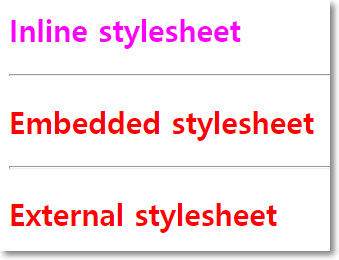

# [STS-121 실습] 웹 프론트엔드 개발 기초::HTML

[![Dinfree][din-badge]][din-url]
[![Subject][html-badge]][din-url]
[![Subject][css-badge]][din-url]
[![Subject][js-badge]][din-url]

## 시작하기 전에
이 페이지는 프론트엔드 웹 프로그래밍의 기본이 되는 [STS-121] HTML 기초 강좌의 예제 학습 페이지 입니다. 동영상이 포함된 강좌는 [STS-121][] 에서 보실수 있습니다. 이곳에서는 각 챕터별 예제들과 간단한 프로젝트형식의 종합예제를 정리해서 제공하고 있습니다. 각각의 예제는 github 리파지토리에서 받아가실수 있으며 첨부된 설명에 따라 학습을 진행하면 됩니다. 실습을 위한 모든 환경설정은 `공통기초->[STS-103]개발도구` 에서 다루었습니다. 따라서 해당학습을 진행하지 않았다면 반드시 먼저 살펴보고 실습을 진행하기 바랍니다.

### 목차
1. css 개념 이해
2. 기본 문법과 포함 방법
3. 셀렉터 기초  
4. 컬러, 배경색 지정하기
5. css 단위, 박스모델
6. 복합셀렉터
7. 레이아웃, 정렬, 인라인블럭

--- 

## 1. css 개념 이해
### 예제 1-1) css 사용 이유
본 예제에서는 css를 사용하는 이유를 알아보기 위해 웹 페이지의 소스코드 저장하여 html로만 이루어진 사이트와 css가 적용된 사이트를 비교하여봅니다.

#### step-1> 웹브라우저 실행하여 url 입력하기
```
웹 브라우저를 실행하고 상단의 URL 창에 다음 주소를 입력하고 엔터를 칩니다.
- http://www.naver.com
```
#### step-2> 소스 코드 다운받기
```
웹 브라우저 화면에서 오른쪽 버튼을 눌러 다른 이름으로 저장을 선택하여 적당한 곳에 저장합니다.
```


#### step-3> 파일 열기
```
저장을 한 폴더에 가서 확인을 해보면 NAVER_files과 NAVER.html 두 개의 파일이 저장되어 있습니다. 
이 중 NAVER_files을 삭제한 뒤, NAVER.html 파일을 실행시킵니다.
```

#### step-4> 결과 확인
html로만 이루어진 NAVER화면과 CSS가 적용되어 있던 기존 NAVER화면을 비교해봅시다.


## 2. 기본 문법과 포함 방법
### 예제 2-1) css 기본 문법
본 예제에서는 css의 기본적인 문법을 알아보고, html 파일에 적용시켜 스타일을 변경해봅니다.

#### step-1> 예제 파일 생성 (css_2-1.html)
앞서 진행하였던 html 예제들 중, 2-1.html 파일을 복사하여 css_2-1.html 파일을 생성합니다.

#### step-2> css 소스 코드 작성
다음과 같이 css 코드를 작성합니다. css를 html파일 안에 포함시키기 위해 `<head>`태그 안에 `<style>`태그를 넣어주고 그 안에 아래와 같이 코드를 작성하여 `<h2>`태그의 색깔을 파랑색으로 변경해봅니다. blue가 아닌, 원하는 다른 색으로 넣어주어도 무방합니다.

```html
<head>
    <style>
        h2 {color: blue;}
    </style>
</head>
```


#### step-3> 실행결과 확인
브라우저에서 실행결과를 확인 합니다.


### 예제 2-2) css 포함 방법
본 예제에서는 css를 포함하는 3가지 방법에대해 알아봅니다.

#### step-1> 소스 코드 작성 (css_2-2.html)
css_2-2.html 파일을 생성하고 다음과 같이 소스코드를 작성하여 스타일을 적용 할 문서를 생성합니다.

```html
<!doctype html>
<html>
    <head>
        <title>css_2-2.html</title>
    </head>
    <body>
        <h2>Inline stylesheet</h2>
        <hr>
        <h2>Embedded stylesheet</h2>
        <hr>
        <h2>External stylesheet</h2>                                 
    </body>
</html>
```

#### step-2> 인라인 스타일
인라인 스타일 방식으로 css를 적용시키기위해, 위에서 작성한 css_2-2.html의 코드를 아래처럼 수정합니다.

```html
<h2 style="color: fuchsia">Inline stylesheet</h2>
```


#### step-3> 실행결과 확인
브라우저에서 실행결과를 확인 합니다. 


#### step-4> 내부 스타일시트
내부 스타일시트 방식으로 css를 적용시키기위해 css_2-2.html의 코드를 아래처럼 수정합니다.

```html
<head>
    <style>
        h2 {
            color: darkorange;
        }
    </style>
</head>
```


#### step-5> 실행결과 확인
브라우저에서 실행결과를 확인 합니다. 


#### step-6> css 코드 작성 (css_2-2.css)
외부 스타일시트 방식으로 포함을 시킬 css파일을 만들기위해, css_2-2.css파일을 생성하고 다음과 같이 코드를 작성합니다.

```css
h2 {
    color: red;
}
```

#### step-7> 외부 스타일시트
css_2-2.css파일을 외부 스타일시트 방식으로 html 파일에 포함시키기 위해 css_2-2.html의 코드를 아래처럼 수정합니다.

```html
<head>
    <style>
        h2 {
            color: darkorange;
        }
    </style> 
    <link rel="stylesheet" type="text/css" href="css_2-2.css">
</head>
```
#### step-8> 실행결과 확인
브라우저에서 실행결과를 확인 합니다. 




[din-badge]:https://img.shields.io/badge/dinfree-edu-orange.svg
[din-url]:https://github.com/dinfree
[css-badge]:https://img.shields.io/badge/frontend-css-ff69b4.svg
[html-badge]:https://img.shields.io/badge/frontend-html-brightgreen.svg
[js-badge]:https://img.shields.io/badge/frontend-javascript-red.svg
