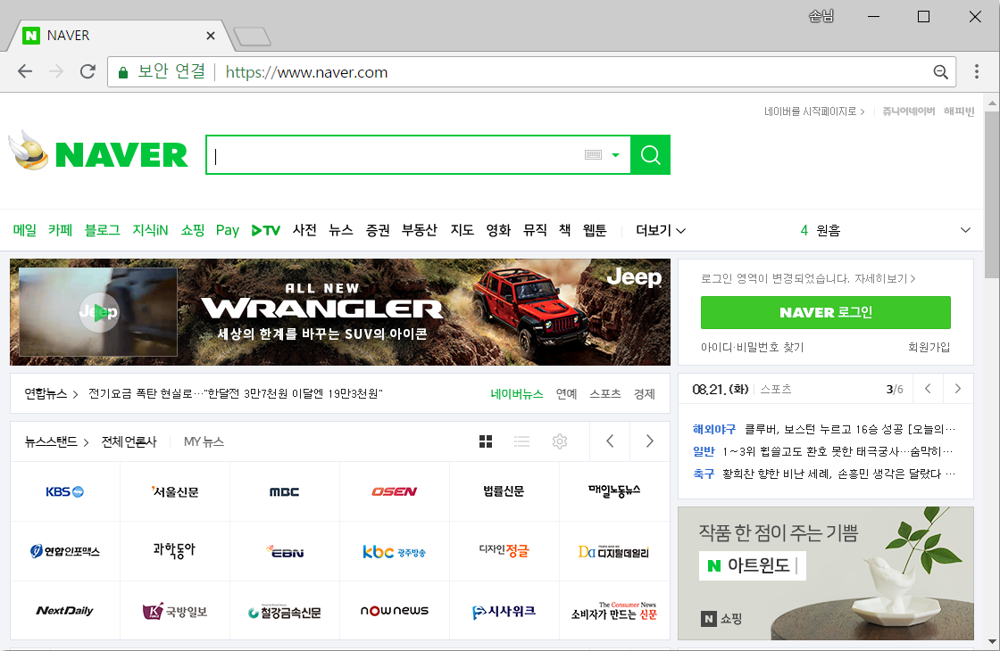
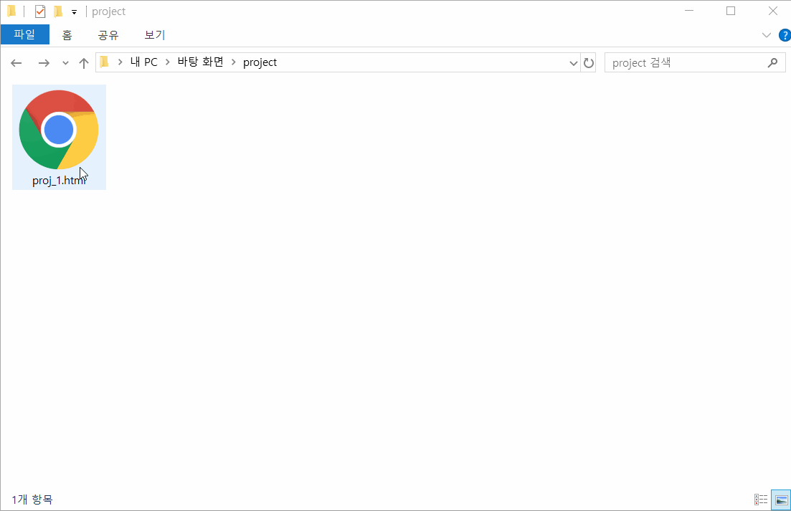
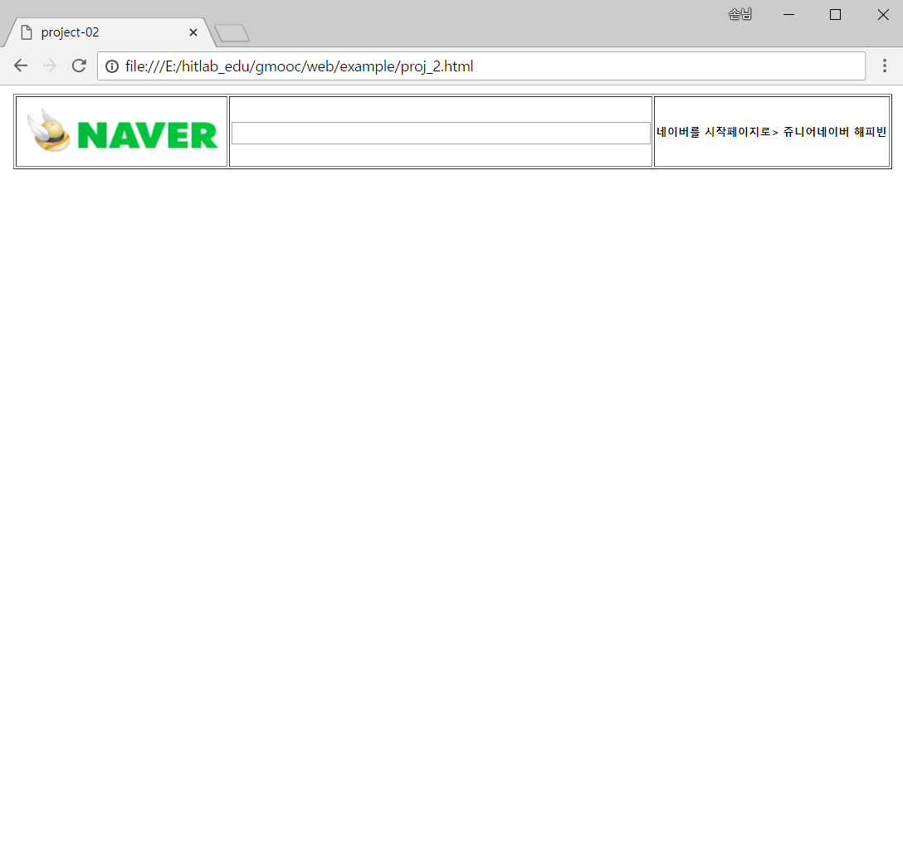
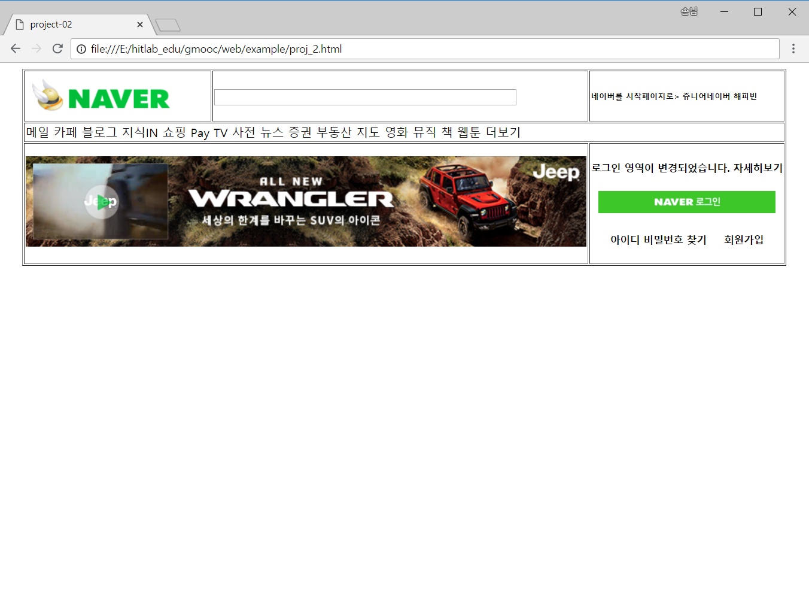
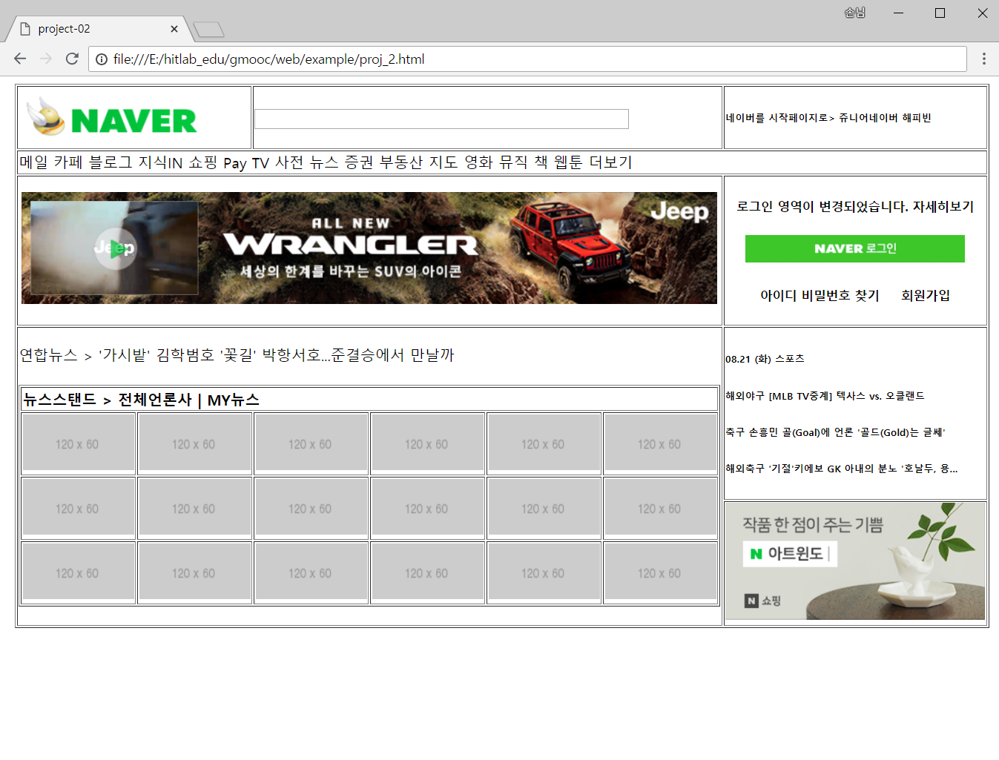
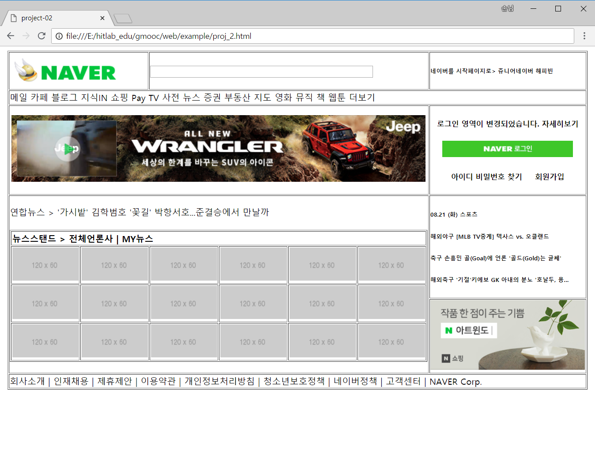
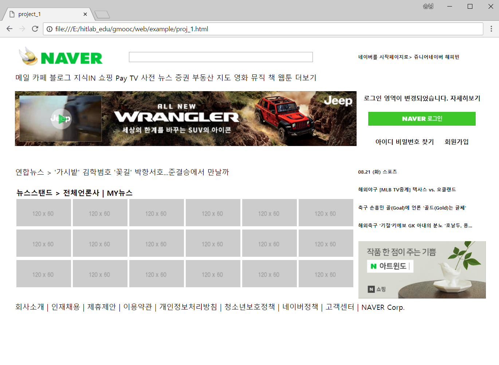
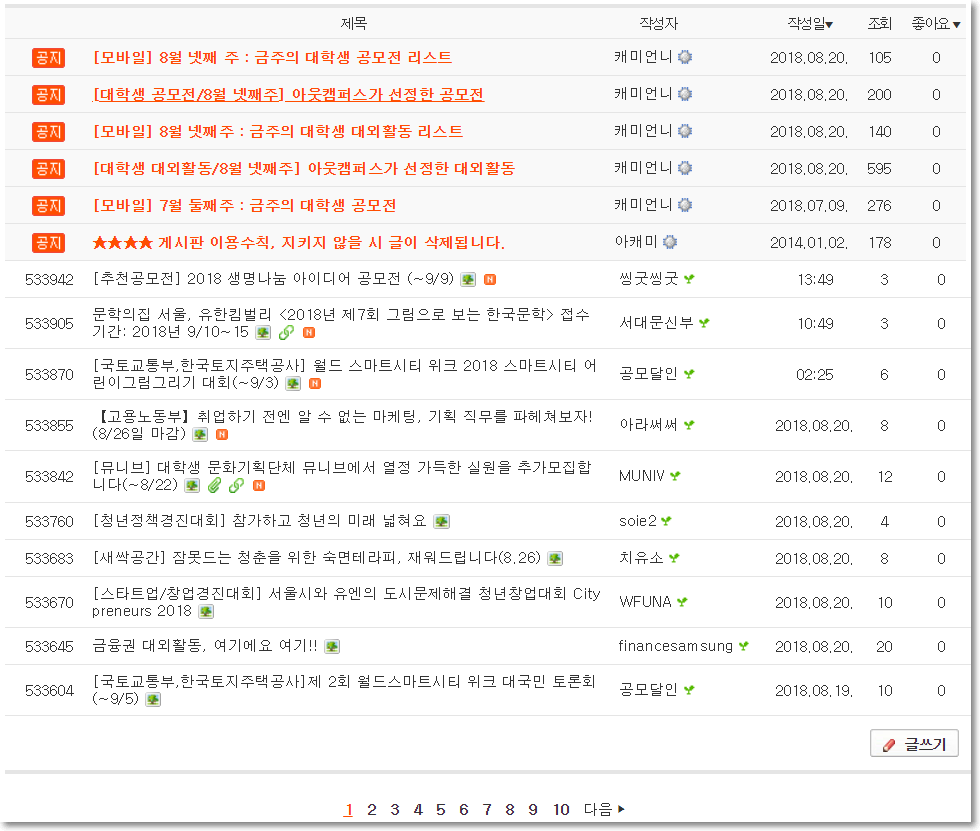
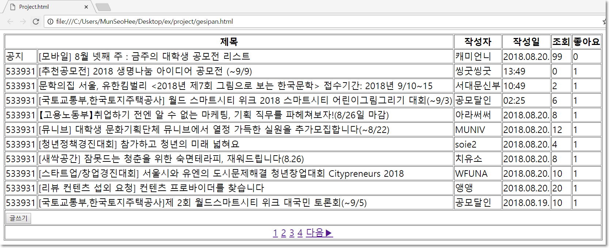

# [STS-121 종합실습] 웹 프론트엔드 개발 기초::HTML

[![Dinfree][din-badge]][din-url]
[![Subject][html-badge]][din-url]
[![Subject][css-badge]][din-url]
[![Subject][js-badge]][din-url]

## 시작하기 전에
이 페이지는 프론트엔드 웹 프로그래밍의 기본이 되는 [STS-121] HTML 기초 강좌의 종합실습 페이지 입니다. 기본실습 예제와 달리 종합실습에서는 HTML 구성요소들을 종합적으로 이해하고 응용 할 수 있는 예제로 구성 되어 있습니다.

### 목차
1. [포탈 메인 화면 만들기](#m1)
2. [게시판 만들기](#m2)

---
<a id="m1"></a>
## 1. 포탈 메인 화면 만들기
### 개요
본 예제에서는 네이버, 다음과 같은 포탈의 메인화면을 만들어 봅니다. 물론 css를 아직 배우지 않았기 때문에 제대로 된 화면을 제작하기는 매우 어렵지만 지금까지 배운 html 태그들을 모두 활용해 최대한 비슷하게 구성해 봅니다.

### step-1> 대상 선정하기
```
- 크롬 웹브라우저에서 `네이버`를 들어갑니다.
- 네이버 메인 화면을 기준으로 합니다.
- 메인 화면 전체가 아닌 부분만 구성합니다.
```

<kbd></kbd>

### step-2> 레이아웃 분석하기

<kbd></kbd>

- HTML \<table>태그를 이용합니다.
- 먼저 헤더, 바디, 푸터 세부분으로 레이아웃을 나눕니다.
- 병합이 이루어진 셀은 `colspan`과 `rowspan`을 이용하여 구성합니다.

### step-3> 리소스 준비하기

<kbd></kbd>

- 우클릭하여 이미지 저장이 안되는 컨텐츠는 캡처를 합니다.
- 리소스는 해당 소스파일이 있는 폴더 안에 res폴더를 만들어 저장합니다.

### step-4> HTML 기본 구조 작성 (project_1.html)

project_1.html 파일을 생성하고 기본적인 HTML코드 작성을 위해 아래와 같이 코드를 입력합니다.

```html
<!DOCTYPE html>
<html>
<head>
    <title>project_1.html</title>
</head>
<body>
    
</body>
</html>
```

### step-5> 테이블 구조 생성 - 헤더

테이블 구조는 step-2> 레이아웃 분석의 이미지를 기준으로 작성합니다. 먼저, 네이버 로고와 검색창이 있는 부분을 헤더로 잡습니다.

```html
<body>
    <table border="1" align="center">
        <thead>
            <tr>
                <td>
                    
                </td>
                <td rowspan="2">
                    <input type="text" name="text" style="width:400px;" />
                </td>
                <td>
                    <h6>네이버를 시작페이지로> 쥬니어네이버 해피빈</h6>
                </td>
            </tr>
        </thead>
    </table>
</body>
```

<details>
<summary>결과보기</summary>
<p></p>

<kbd></kbd>

</details> 

### step-6> 테이블 구조 생성 - 바디(1)

헤더 아래에 있는 메뉴 네비게이션부터 네이버 쇼핑 이미지 부분까지 바디로 잡습니다.
메뉴 네비게이션을 테이블 한 행으로 구성하고, 아래의 배너 이미지와 로그인창을 한 행으로 구성합니다. 

```html
<tbody>
    <tr>
         <td colspan="3">메일 카페 블로그 지식IN 쇼핑 Pay TV 사전 뉴스 증권 부동산 지도 영화  뮤직 책 웹툰 더보기</td>
    </tr>      
    <tr>
        <td colspan="2">
            <center></center>              
        </td>
        <td colspan="1">
        <center><h5>로그인 영역이 변경되었습니다. 자세히보기</h5></center>
        <center></center>
        <center><h5>아이디 비밀번호 찾기&nbsp;&nbsp;&nbsp;&nbsp;&nbsp;회원가입</h5></center>
        </td>
    </tr>
</tbody>
```

<details>
<summary>결과보기</summary>
<p></p>

<kbd></kbd>

</details> 

### step-6> 테이블 구조 생성 - 바디(2)

연합뉴스와 뉴스스탠드 컨텐츠가 있는 영역은 `rowspan`으로 두 개의 행을 병합합니다. 뉴스스탠드 속 이미지 컨텐츠는 또다른 테이블을 만들어 넣어줍니다.

```html
<tr>
    <td colspan="2" rowspan="2">
        <div align=left>연합뉴스 > '가시밭' 김학범호 '꽃길' 박항서호...준결승에서 만날까</div><br>

        <table border="1">
            <tr>
                <th colspan="6" align="left">뉴스스탠드 > 전체언론사  | MY뉴스</th>
            </tr>
            <tbody>
            <tr>
                <td></td>
                <td></td>
                <td></td>
                <td></td>
                <td></td>
                <td></td>
            </tr>
            ...
            ...
            </tbody>
        </table>
    </td>
    <td colspan="1">
        <h6>08.21 (화) 스포츠</h6>
        <h6>해외야구 [MLB TV중계] 텍사스 vs. 오클랜드</h6>
        <h6>축구 손흥민 골(Goal)에 언론 '골드(Gold)는 글쎄'</h6>
        <h6>해외축구 '기절'키에보 GK 아내의 분노 '호날두, 용...</h6>
    </td>
</tr>
<tr>
    <td colspan="1">
    <center></center>
    </td>
</tr>
```

<details>
<summary>결과보기</summary>
<p></p>

<kbd></kbd>

</details> 

### step-6> 테이블 구조 생성 - 푸터

회사소개, 인재채용 등의 텍스트가 있는 영역을 푸터로 구성합니다.

```html
<tfoot>
    <tr rowspan="3">
        <td colspan="3">
        회사소개 | 인재채용 | 제휴제안 | 이용약관 | 개인정보처리방침 | 청소년보호정책 | 네이버정책 | 고객센터 | NAVER Corp.
        </td>
    </tr>
</tfoot>
```
<details>
<summary>결과보기</summary>
<p></p>

<kbd></kbd>

</details> 

### step-9> 결과 확인

테이블 속성의 border를 제거한 후 브라우저에서 실행 결과를 확인합니다.

<kbd></kbd>


---
<a id="m2"></a>
## 2. 게시판 만들기
### 개요
본 예제에서는 네이버, 다음과 같은 포탈 카페의 게시판을 만들어 봅니다. 물론 css를 아직 배우지 않았기 때문에 제대로 된 화면을 제작하기는 매우 어렵지만 지금까지 배운 html 태그들을 모두 활용해 최대한 비슷하게 구성해 봅니다.

### step-1> 대상 선정하기
```
-네이버, 다음 등의 포털 사이트의 카페들 중 하나를 선택합니다.
-본 예제에서는 네이버 카페 '아웃캠퍼스'를 기준으로 설명합니다.
```
### step-2> 레이아웃 분석하기



- 번호, 제목, 작성자, 작성일, 조회, 좋아요의 6개의 열로 구성.
- 테이블 헤더, 게시물 16개, 글쓰기 버튼, 페이지의 총 19개의 행으로 구성.
- 번호와 제목 열은 병합.
- 글쓰기 버튼의 행은 하나로 병합, 페이지 부분의 행도 하나로 병합.


### step-3> html 기본 구조 작성 (project.html)
project.html파일을 생성하고 기본적인 html 코드 작성을위해 아래와 같이 코드를 입력합니다.

```html
<!DOCTYPE html>
<html>
<head>
    <title>Project.html</title>
</head>
<body>
    
</body>
</html>
```

### step-4> 테이블 구조 생성
게시판의 기본적인 테이블 구조를 잡아줍니다. 첫번쨰 행을 살펴보면 제목, 작성자, 작성일, 조회, 좋아요로 구성되어있습니다. 이에 따라 열의 제목을 작성하기 위해 다음과 같이 `<th>`태그를 이용하여 코드를 입력합니다. 

```html
<body>
    <table border="1">
        <tr>
            <th colspan="2">제목</th>
            <th>작성자</th>
            <th>작성일</th>
            <th>조회</th>
            <th>좋아요</th>
        </tr>
    </table>
```

### step-5> 게시글 추가
게시판의 테이블 구조를 따라 게시글들을 추가해줍니다. 게시글 번호, 게시글 제목, 작성자, 작성일, 조회 수, 좋아요 수의 순으로 각 행의 요소를 추가하기위해 아래와같이 코드를 작성합니다.

```html
<tr>
    <td>공지</td>
    <td>[모바일] 8월 넷째 주 : 금주의 대학생 공모전 리스트</td>
    <td>캐미언니</td>
    <td>2018.08.20.</td>
    <td>99</td>
    <td>0</td>
</tr>
<tr>
    <td>533931</td>
    <td>[추천공모전] 2018 생명나눔 아이디어 공모전 (~9/9)</td>
    <td>씽굿씽굿</td>
    <td>13:49</td>
    <td>0</td>
    <td>1</td>
</tr>

        ...
```
> 이후의 코드는 위의 코드의 형식이 반복됨으로, 코드가 너무 길어짐을 방지하기위해 중략합니다.

### step-6> 글쓰기 버튼
글쓰기 버튼의 위치를 보면 한 행 안에 열이 나뉘어져있지 않습니다. 비슷하게 만들어주기위해 열을 병합하고 그 안에 버튼을 추가하기위해 아래와 같이 코드를 작성합니다.

```html
<tr>
    <td colspan="6"><button>글쓰기</button></td>
</tr>

```


### step-7> 페이지 네비게이션
가장 하단의 페이지 부분을 제작합니다. 각 페이지 번호를 `<a>`태그로 감싸 링크를 걸어주고, `<center>`태그를 이용해 가운데 위치하게 하여 카페 게시판과 유사하게 만들어주기 위해 다음과 같이 코드를 작성합니다.

```html
<tr>
    <td colspan="6"><center>
    <a href="#">1</a> 
    <a href="#">2</a> 
    <a href="#">3</a> 
    <a href="#">4</a> 
    <a href="#">다음▶</a>
    </center></td>
</tr>>

```

### step-8> 실행결과 확인
브라우저에서 실행결과를 확인 합니다.



[din-badge]:https://img.shields.io/badge/dinfree-edu-orange.svg
[din-url]:https://github.com/dinfree
[css-badge]:https://img.shields.io/badge/frontend-css-ff69b4.svg
[html-badge]:https://img.shields.io/badge/frontend-html-brightgreen.svg
[js-badge]:https://img.shields.io/badge/frontend-javascript-red.svg
