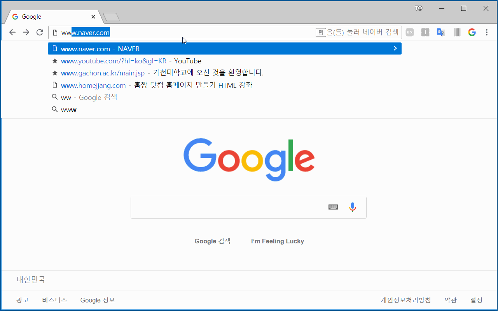
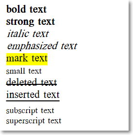
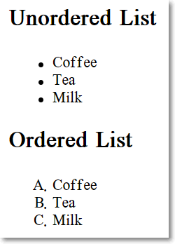
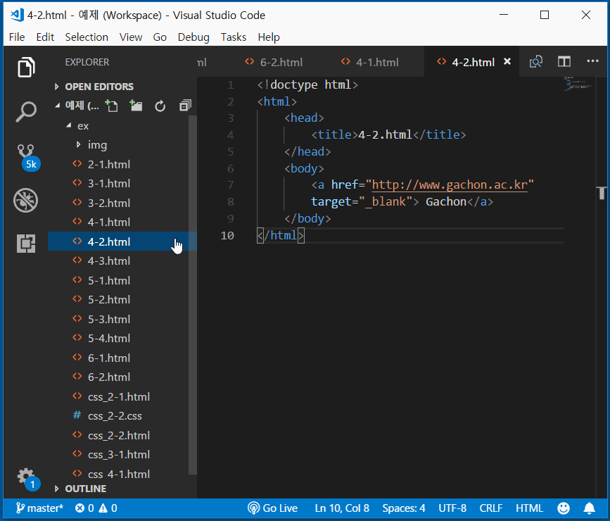
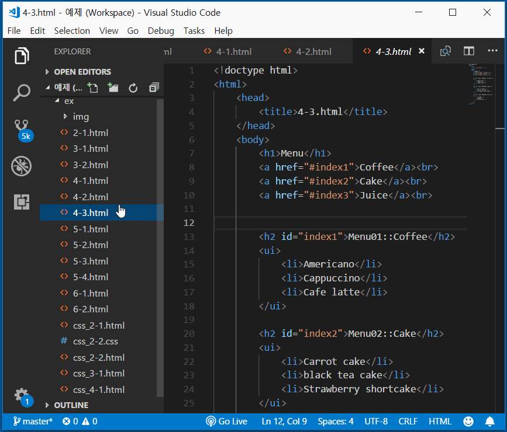
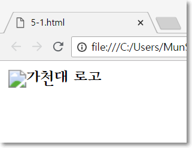

# [STS-121 실습] 웹 프론트엔드 개발 기초::HTML

[![Dinfree][din-badge]][din-url]
[![Subject][html-badge]][din-url]
[![Subject][css-badge]][din-url]
[![Subject][js-badge]][din-url]

## 시작하기 전에
이 페이지는 프론트엔드 웹 프로그래밍의 기본이 되는 [STS-121] HTML 기초 강좌의 예제 학습 페이지 입니다. 동영상이 포함된 강좌는 [STS-121][] 에서 보실수 있습니다. 이곳에서는 각 챕터별 예제들과 간단한 프로젝트형식의 종합예제를 정리해서 제공하고 있습니다. 각각의 예제는 github 리파지토리에서 받아가실수 있으며 첨부된 설명에 따라 학습을 진행하면 됩니다. 실습을 위한 모든 환경설정은 `공통기초->[STS-103]개발도구` 에서 다루었습니다. 따라서 해당학습을 진행하지 않았다면 반드시 먼저 살펴보고 실습을 진행하기 바랍니다.

### 목차
1. 월드와이드웹과 HTML
2. HTML 기본 작성법과 구조
3. 제목, 문단, 형식
4. 목록, 하이퍼링크
5. 이미지, 테이블
6. 입력양식

---

## 1. 월드와이드웹과 HTML
### 예제 1-1) 웹페이지 요청하기와 소스 보기
본 예제에서는 url 을 이용해 원하는 웹페이지를 직접 요청하는 과정을 통해 웹의 기본적인 동작구조인 request -> response 개념을 살펴보게 됩니다. 또한 웹브라우저 화면에 보이는 콘텐츠의 소스 보기를 통해 서버에서 전달된 원본 콘텐츠는 텍스트형식으로 된 html 구조라는 것을 확인해 봅니다.

#### step-1> 웹브라우저 실행하기
```
크롬 웹브라우저를 실행 합니다. 인터넷 익스플로러/엣지 브라우저도 상관없으나 모든 설명은 크롬을 기준으로 합니다.
```
#### step-2> url 입력하기
```
- 웹프라우저 상단의 URL 창에 다음의 주소중 하나를 입력하고 엔터를 칩니다.
- http://www.naver.com
- http://www.apple.com
```


#### step-3> 소스 보기
```
- 웹브라우저 화면에서 오른쪽 마우스를 눌러 페이지 소스보기를 선택합니다.
- 보이는 텍스트들이 현재 화면을 구성하고 있는 html 소소 입니다.
```




## 2. HTML 기본 작성법과 구조
### 예제 2-1) HTML 기본문서 작성과 실행하기
본 예제에서는 HTML 파일을 생성하고 HTML 문서의 기본 구조를 작성해 봅니다. 앞으로 진행되는 모든 예제는 별도의 폴더를 생성해 관리할 수 있도로 합니다. github repository 에는 `example/sts-121-html`, `example/sts-122-css`, `example/sts-123-js` 로 구분되어 있습니다. Visual Studio Code 에서는 example 폴더를 오픈해서 사용하면 됩니다.

#### step-1> Visual Studio Code 실행
```
- HTML 문서 작성을 위해 Visual Studio Code 를 실행 합니다. 만일 설치하지 않았다면 공통기초->[STS-103]개발도구 를 참고하기 바랍니다.
- Visual Studio Code 는 공통기초->[STS-103]개발도구 에서 설명한것 처럼 영어 언어 설정으로 사용합니다.
- 미리 생성해둔 예제폴더를 Open Folder 버튼을 이용해 오픈한 다음 New file 버튼을 클릭해 새로운 파일을 생성하고 2-1.html 이라 이름을 입력합니다.
```

#### step-2> html 소스코드 작성(2-1.html)
다음과 같이 html 코드를 작성합니다. 들여쓰기는 프로그램 소스 작성시 가독성 향상을 위해 중요한 요소 이므로 탭 키를 이용해 반드시 들여쓰기를 하 수 있도록 합니다.
```html
<!doctype html>
<html>
    <head>
        <title>2-1.html</title>
    </head>
    <body>
        <H2>2-1.html</H2>
        <HR>
        example 2-1.html
    </body>
</html>
```

#### step-3> 실행 및 결과 확인
파일을 선택후 오른쪽 마우스를 눌러 open in browser 메뉴를 선택해 브라우저에서 실행결과를 확인 합니다. 메뉴가 보이지 않을 경우 `공통기초->[STS-103]개발도구` 를 다시 참조해 해당 플러그인을 설치후 진행하기 바랍니다.


## 3. 제목, 문단, 형식
### 예제 3-1) 제목과 문단으로 웹 문서 작성
본 예제에서는 `<h>`태그들의 차이를 확인하고, HTML에서의 문단을 이해하며 `<p>`태그와 `<br>`태그를 사용해 웹 문서를 작성해봅니다. 


#### step-1> html 소스코드 작성 (3-1.html)
New file 버튼을 클릭해 새로운 파일을 생성해 3-1.html 이라 이름을 입력하고 다음과 같이 html 코드를 작성합니다.


```html
<!doctype html>
<html> 
    <head>
        <title>3-1.html</title>
    </head>
    <body>
        <h1>3-1.html</h1>
        <h3>html example</h2>
        
        <p>hello world</p>
        <p>hello

                     world
        </p>
        <p>hello<br>world</p>
        
    </body>
</html>
```
#### step-2> 실행 및 결과 확인
파일을 선택후 오른쪽 마우스를 눌러 open in browser 메뉴를 선택해 브라우저에서 실행결과를 확인 합니다.<br>아래 결과와 같이 HTML에서는 본문 내에서 연속된 공백이나 줄 바꿈은 하나의 공백으로 처리합니다.


### 예제 3-2) 텍스트 관련 태그들
본 예제에서는 텍스트 관련 태그들에는 무엇이 있는지 살펴보고, 각 태그들에 의해 텍스트가 어떻게 변하는지를 살펴봅니다.

#### step-1> html 소스코드 작성 (3-2.html)
New file 버튼을 클릭해 새로운 파일을 생성해 3-2.html 이라 이름을 입력하고 다음과 같이 html 코드를 작성합니다.


```html
<!doctype html>
<html> 
    <head>
        <title>3-2.html</title>
    </head>
    <body>
        <b>bold text</b><br>
        <strong>strong text</strong><br>
        <i>italic text</i><br>
        <em>emphasized text</em><br>
        <mark>mark text</mark><br>
        <small>small text</small><br>
        <del>deleted text</del><br>
        <ins>inserted text</ins><br>
        <sub>subscript text</sub><br>
        <sup>superscript text</sup>
    </body>
</html>
```
#### step-2> 실행 및 결과 확인
파일을 선택후 오른쪽 마우스를 눌러 open in browser 메뉴를 선택해 브라우저에서 실행결과를 확인 합니다.



## 4. 목록, 하이퍼링크
### 예제 4-1) 목록 만들기
본 예제에서는 순서가 있는 목록과 순서가 없는 목록, 두 가지를 작성해봅니다. 또한 `type`속성을 이용하면 리스트가 어떻게 바뀌는지 확인해봅니다. 


#### step-1> html 소스코드 작성 (4-1.html)
New file 버튼을 클릭해 새로운 파일을 생성하고 4-1.html 이라 이름을 입력하고 다음과 같이 html 코드를 작성합니다.

```html
<!doctype html>
<html> 
    <head>
        <title>4-1.html</title>
    </head>
    <body>
        <h2>Unordered List</h2>
        <ul>
        <li>Coffee</li>
        <li>Tea</li>
        <li>Milk</li>
        </ul>  

        <h2>Ordered List</h2>
        <ol>
        <li>Coffee</li>
        <li>Tea</li>
        <li>Milk</li>
        </ol> 
    </body>
</html>
```
#### step-2> 실행 및 결과 확인
파일을 선택후 오른쪽 마우스를 눌러 open in browser 메뉴를 선택해 브라우저에서 실행결과를 확인 합니다.


#### step-3> type 속성 추가
위에서 작성한 4-1.html의 코드를 아래처럼 수정합니다.

```html
<!doctype html>
<html> 
    <head>
        <title>4-1.html</title>
    </head>
    <body>
        <h2>Unordered List</h2>
        <ul>
        <li>Coffee</li>
        <li>Tea</li>
        <li>Milk</li>
        </ul>  

        <h2>Ordered List</h2>
        <ol type="A">
        <li>Coffee</li>
        <li>Tea</li>
        <li>Milk</li>
        </ol> 
    </body>
</html>
```

#### step-4> 실행 및 결과 확인
파일을 선택후 오른쪽 마우스를 눌러 open in browser 메뉴를 선택해 브라우저에서 실행결과를 확인 합니다.




### 예제 4-2) 하이퍼링크 사용하기
본 예제에서는 `<a>`태그를 통해 하이퍼링크를 사용해봅니다. `<a>`태그의 기본적인 사용법을 살표보고 `target`속성에 대해 알아봅니다.


#### step-1> html 소스코드 작성 (4-2.html)
New file 버튼을 클릭해 새로운 파일을 생성하고 4-2.html 이라 이름을 입력하고 다음과 같이 html 코드를 작성합니다.

```html
<!doctype html>
<html> 
    <head>
        <title>4-2.html</title>
    </head>
    <body>
        <a href="http://www.gachon.ac.kr">Gachon</a>
    </body>
</html>
```
#### step-2> 실행 및 결과 확인
파일을 선택후 오른쪽 마우스를 눌러 open in browser 메뉴를 선택해 브라우저에서 실행결과를 확인 합니다.


#### step-3> target 속성 추가
위에서 작성한 4-2.html의 코드를 아래처럼 수정합니다.

```html
<!doctype html>
<html> 
    <head>
        <title>4-2.html</title>
    </head>
    <body>
        <a href="http://www.gachon.ac.kr" target="_self">Gachon</a>
    </body>
</html>
```

#### step-4> 실행 및 결과 확인
파일을 선택후 오른쪽 마우스를 눌러 open in browser 메뉴를 선택해 브라우저에서 실행결과를 확인 합니다. `target`속성은 연결된 문서를 열 위치를 지정합니다. `_self`로 지정을 해둘 경우, 현재의 창에서 열게 됩니다.



### 예제 4-3) 책갈피
본 예제에서는 `<a>`태그를 통해 본문 내에서 특정한 위치로 이동하는 책갈피 기능을 사용해봅니다.


#### step-1> html 소스코드 작성 (4-3.html)
New file 버튼을 클릭해 새로운 파일을 생성하고 4-3.html 이라 이름을 입력하고 다음과 같이 html 코드를 작성합니다.

```html
<!doctype html>
<html> 
    <head>
        <title>4-3.html</title>
    </head>
    <body>
        <a href="#menu1">go to menu1</a><br>
        <a href="#menu2">go to menu2</a><br>
        <a href="#menu3">go to menu3</a><br>

        <br><br><br><br><br><br><br><br><br><br><br>
        <h2 id="menu1">Menu1</h2>
        <br><br><br><br><br><br><br><br><br><br><br>
        <br><br><br><br><br><br><br><br><br><br><br>
        <h2 id="menu2">Menu2</h2>
        <br><br><br><br><br><br><br><br><br><br><br>
        <br><br><br><br><br><br><br><br><br><br><br>
        <h2 id="menu3">Menu3</h2>
        <br><br><br><br><br><br><br><br><br><br><br>
        <br><br><br><br><br><br><br><br><br><br><br>

    </body>
</html>
```
#### step-2> 실행 및 결과 확인
파일을 선택후 오른쪽 마우스를 눌러 open in browser 메뉴를 선택해 브라우저에서 실행결과를 확인 합니다.




## 5. 이미지, 테이블
### 예제 5-1) 이미지 추가
본 예제에서는 ``태그를 통해 이미지를 삽입합니다. 이미지를 삽입하는 2가지 방식을 알아보고, 이미지의 크기를 조절합니다. 또한 `alt`속성을 적용하여봅니다.


#### step-1> 이미지 준비
웹 사이트에서 원하는 이미지를 찾습니다. 해당 이미지를 예제폴더 안에 저장하고, 이미지를 좌클릭하여 이미지의 주소를 복사합니다.


#### step-2> html 소스코드 작성 (5-1.html)
New file 버튼을 클릭해 새로운 파일을 생성해 5-1.html 이라 이름을 입력하고 다음과 같이 html 코드를 작성합니다. 첫번째 `img`태그의 `src`속성에는 복사한 이미지의 주소를, 두번째 `img`태그의 `src`속성에는 저장한 이미지의 경로를 입력합니다.


```html
<!doctype html>
<html> 
    <head>
        <title>5-1.html</title>
    </head>
    <body>
        
        
    </body>
</html>
```
#### step-3> 실행 및 결과 확인
파일을 선택후 오른쪽 마우스를 눌러 open in browser 메뉴를 선택해 브라우저에서 실행결과를 확인 합니다.


#### step-4> 이미지 크기 조절
위에서 작성한 4-2.html의 코드를 아래처럼 수정합니다.

```html
<!doctype html>
<html> 
    <head>
        <title>5-1.html</title>
    </head>
    <body>
        
        
    </body>
</html>
```

#### step-5> 실행 및 결과 확인
파일을 선택후 오른쪽 마우스를 눌러 open in browser 메뉴를 선택해 브라우저에서 실행결과를 확인 합니다.


#### step-6> alt 속성 적용
위에서 작성한 4-2.html의 코드를 아래처럼 수정합니다. `alt`속성의 적용 여부를 확인하기 위해 이미지의 경로 혹은 이미지의 주소를 틀리게 설정합니다.

```html
<!doctype html>
<html> 
    <head>
        <title>5-1.html</title>
    </head>
    <body>
        
        
    </body>
</html>
```

#### step-7> 실행 및 결과 확인
파일을 선택후 오른쪽 마우스를 눌러 open in browser 메뉴를 선택해 브라우저에서 실행결과를 확인 합니다.




[din-badge]:https://img.shields.io/badge/dinfree-edu-orange.svg
[din-url]:https://github.com/dinfree
[css-badge]:https://img.shields.io/badge/frontend-css-ff69b4.svg
[html-badge]:https://img.shields.io/badge/frontend-html-brightgreen.svg
[js-badge]:https://img.shields.io/badge/frontend-javascript-red.svg
