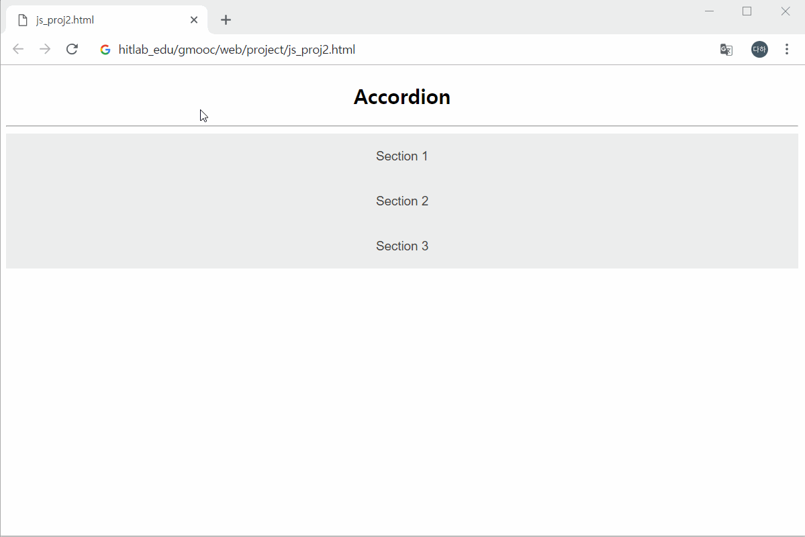
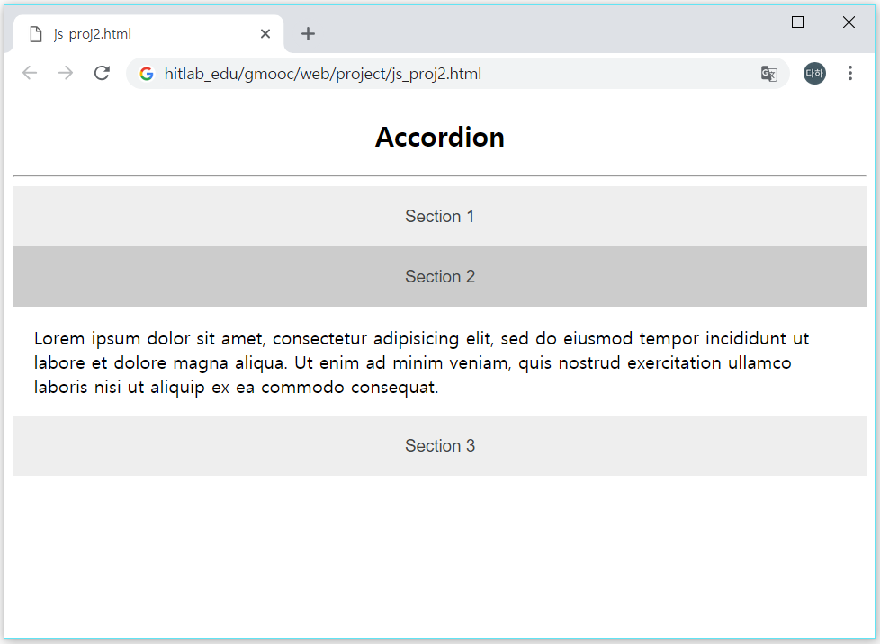
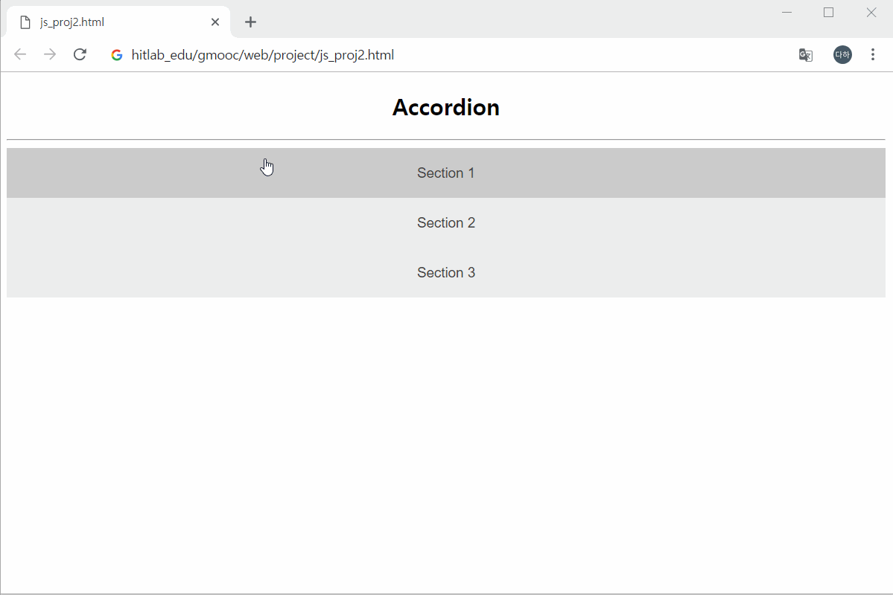
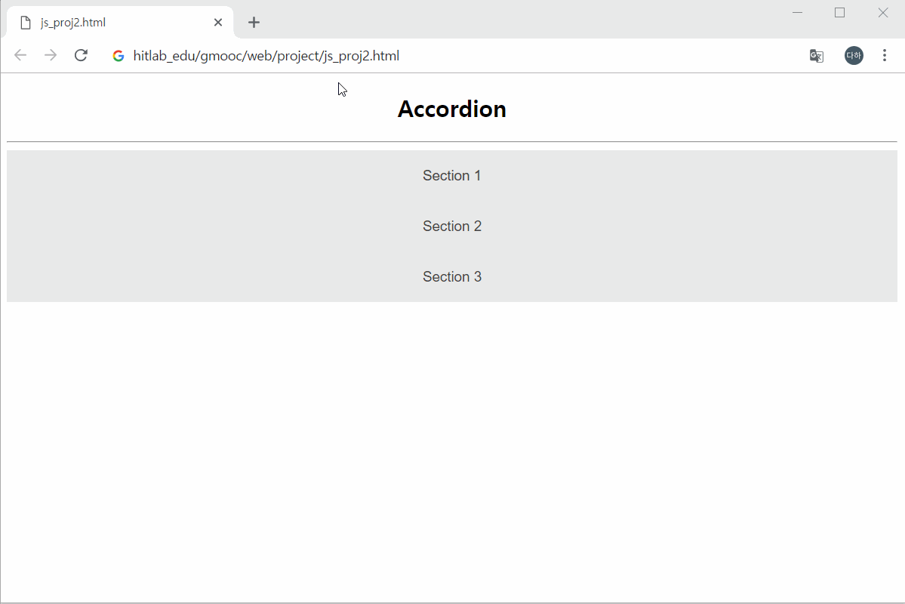
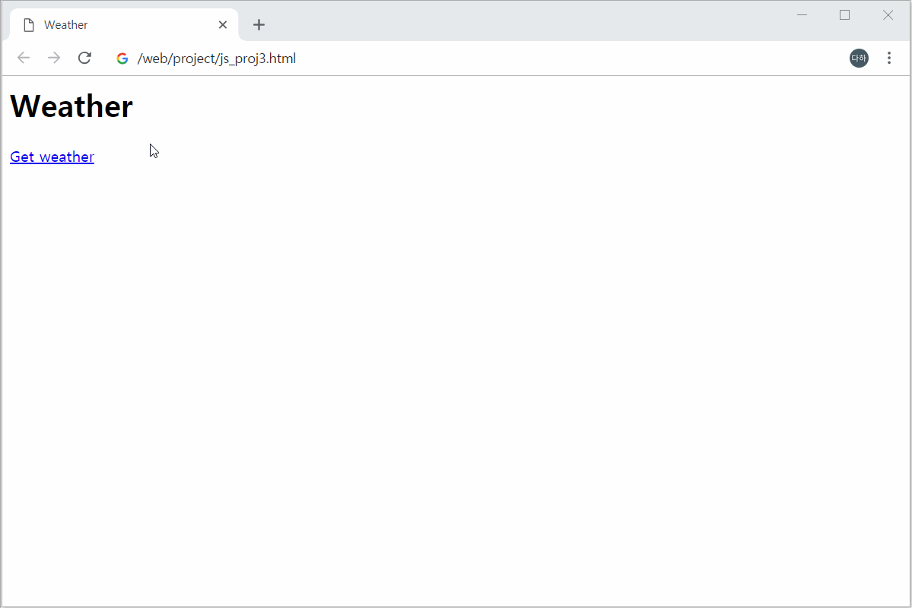
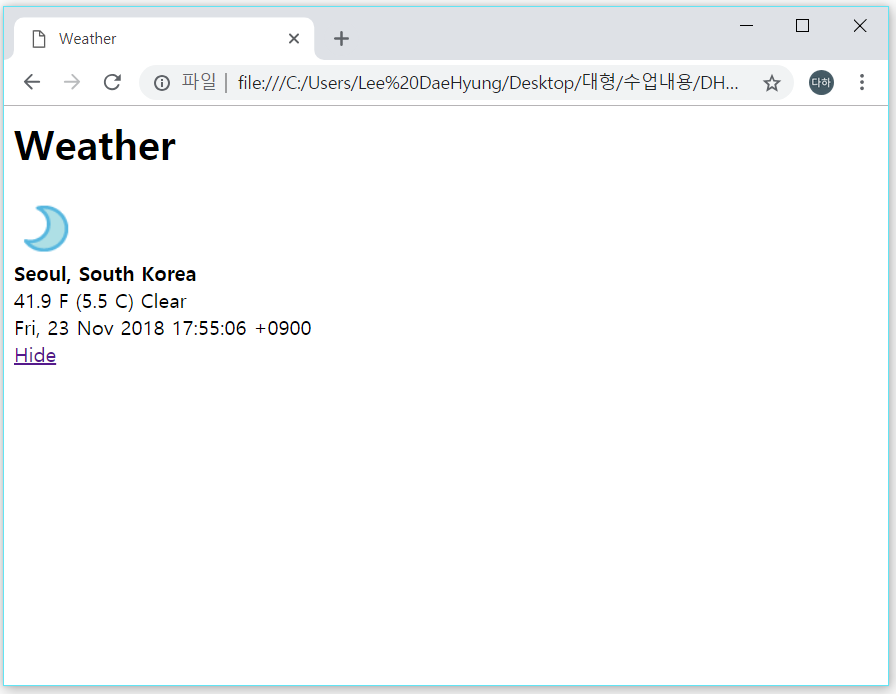
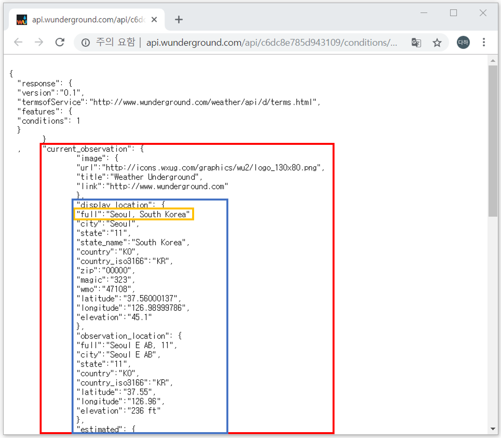

<p id="m1"></p>
### 01. 자바스크립트와 DOM을 이용한 회원가입 폼 만들기
본 예제에서는 회원가입 화면을 만들어 봅니다. 회원가입뿐만 아니라 입력 창에 기입한 정보의 유효성을 확인하여 회원가입에 알맞는 양식인지 확인합니다.


### step-2> 레이아웃 분석하기

<class="img-shadow" alt="proj_1-1" src="img/js_proj1_01.png" width="80%">

- \<input>태그를 이용합니다.
- Sign up 버튼을 누르면 각 입력칸의 값을 DOM형식으로 받아와 자바스크립트로 해당 값의 조건을 검사합니다.


### step-4> HTML 기본 구조 작성 (project_1.html)

project_1.html 파일을 생성하고 기본적인 HTML코드 작성을 위해 아래와 같이 코드를 입력합니다.

```html
<!DOCTYPE html>
<html>
<head>
    <title>project_1.html</title>
</head>
<body>
    
</body>
</html>
```


---
<p id="m2"></p>

## 2. Accordion UI 만들기
본 예제에서는 Section버튼을 누르면 그 Section속에 있는 내용을 펼쳤다 접는것을 반복할 수 있습니다. 
<details>
<summary>Accordion UI 보기</summary>




</details> 


### step-1> 레이아웃 분석하기


- Section 버튼으로 나눠져있습니다.
- Section 버튼에 마우스를 올리면 색이 변합니다.
- Section 버튼을 클릭하면 Section2와 같이 내용이 아래로 나타납니다.
- 다시 Section 버튼을 누르면 내용이 위로 사라집니다.

### step-2> html 기본 구조 작성 (project2.html)
project2.html파일을 생성하고 기본적인 html 코드 작성을 위해 아래와 같이 코드를 입력합니다.

```html
<!DOCTYPE html>
<html>
<head>
    <title>Project2.html</title>
    <style>

    </style>
</head>
<body>

</body>
</html>
```

### step-3> Accordion CSS 속성 설정
- style 태그 안에 CSS를 이용하여 Accordion의 속성을 설정합니다.
- 배경색(background-color)과 글자색(color)을 설정합니다.
- 각 Section 부분에 마우스를 올리면 마우스 모양이 pointer로 바뀌도록 설정합니다.
- transition 값을 설정하여 마우스를 올릴때 Section 부분이 0.4s 동안 어두워지도록 합니다.

```html
<style>
.accordion {
    background-color: #eee;
    color: #444;
    cursor: pointer;
    padding: 18px;
    width: 100%;
    border: none;
    outline: none;
    font-size: 15px;
    transition: 0.4s;
}
```
<details>
<summary>결과보기</summary>


</details> 

### step-4> panel CSS 속성 설정
- 각 Section 내용의 속성을 설정합니다.
- Section 부분과 배경색의 차이를 두기 위해 배경을 흰색으로 설정합니다.
- max-height를 0으로 설정하여 내용이 보이지 않도록 합니다.
- overflow를 hidden으로 설정하여 내용이 지정된 범위 내에서만 보이도록 합니다.
- transition을 설정하여 0.2s동안 max-height가 될 때까지 늘어납니다. 
- ease-out으로 설정하여 늘어나는 속도가 빠르게 진행되다가 점점 느려지도록 합니다.

```html
.panel {
    padding: 0 18px;
    background-color: white;
    max-height: 0;
    overflow: hidden;
    transition: max-height 0.2s ease-out;
}
```
<details>
<summary>결과보기</summary>




</details> 

### step-5> .active, .accordion:hover 속성 설정
Section부분에 마우스를 올렸을 때 색을 지정합니다.

```html
.active, .accordion:hover {
    background-color: #ccc; 
}
</style>
</head>

```


### step-6> Section 생성
- 클래스가 accordion인 `<button>` 을 이용하여 Section 버튼을 만듭니다. 
- Section 버튼을 누르면 Section의 내용이 나오도록 panel 속성을 가진 `<div>` 태그를 만듭니다. 
```html
<body>

<div align=center>
<h2>Accordion</h2>

<hr>

<button class="accordion">Section 1</button>
<div class="panel" align=left>
  <p>Lorem ipsum dolor sit amet, consectetur adipisicing elit, sed do eiusmod tempor incididunt ut labore et dolore magna aliqua. Ut enim ad minim veniam, quis nostrud exercitation ullamco laboris nisi ut aliquip ex ea commodo consequat.  </p>
</div>

```
> 이후의 코드는 위의 코드와 반복되므로 코드가 너무 길어짐을 방지하기 위해 중략합니다.

### step-7> accordion의 기능을 수행하도록 하는 script 코드
- 클래스 이름이 accordion인 태그들을 acc 배열에 저장합니다.
- 반복문을 이용해 acc[i] 클릭시 function이 수행하도록 이벤트를 등록합니다.
- this.classList.toggle("active") 은 accordion 속성을 가지고 있는 element에 active속성 추가/제거 하여 Section 버튼을 누를 때마다 Accordion 기능이 활성화되고 비활성화 되는 것을 반복할 수 있습니다.
- this.nextElementSibling을 통해 accordion클래스 다음의 클래스인 panel 클래스를 가지는 태그들이 panel변수에 저장됩니다.
- panel의 maxHeight의 값이 0이 아니라면 null값으로 만들고, 값이 0이면 panel의 maxHeight값을 Section 내부의 내용만큼의 height로 만듭니다. 

```html
<script>
var acc = document.getElementsByClassName("accordion");
var i;

for (i = 0; i < acc.length; i++) {
    acc[i].addEventListener("click", function() {
        this.classList.toggle("active");
        var panel = this.nextElementSibling;
        if (panel.style.maxHeight) {
            panel.style.maxHeight = null;
        } else {
            panel.style.maxHeight = panel.scrollHeight +"px";
        }
    });
}
</script>
</div>
</body>
</html>
```
<details>
<summary>결과보기</summary>




</details> 

### step-8> Accordion UI 전체 소스코드
<details>
<summary>전체 소스코드 보기</summary>

```html
<!DOCTYPE html>
<html>
<head>

<style>
.accordion {
    background-color: #eee;
    color: #444;
    cursor: pointer;
    padding: 18px;
    width: 100%;
    border: none;
    outline: none;
    font-size: 15px;
    transition: 0.4s;
}

.active, .accordion:hover {
    background-color: #ccc; 
}

.panel {
    padding: 0 18px;
    background-color: white;
    max-height: 0;
    overflow: hidden;
    transition: max-height 0.2s ease-out;
}
</style>
</head>
<body>

<div align=center>
<h2>Accordion</h2>

<hr>

<button class="accordion">Section 1</button>
<div class="panel" align=left>
  <p>Lorem ipsum dolor sit amet, consectetur adipisicing elit, sed do eiusmod tempor incididunt ut labore et dolore magna aliqua. Ut enim ad minim veniam, quis nostrud exercitation ullamco laboris nisi ut aliquip ex ea commodo consequat.  </p>
</div>

<button class="accordion">Section 2</button>
<div class="panel" align=left>
  <p>Lorem ipsum dolor sit amet, consectetur adipisicing elit, sed do eiusmod tempor incididunt ut labore et dolore magna aliqua. Ut enim ad minim veniam, quis nostrud exercitation ullamco laboris nisi ut aliquip ex ea commodo consequat.  </p>
</div>

<button class="accordion">Section 3</button>
<div class="panel" align=left>
  <p>Lorem ipsum dolor sit amet, consectetur adipisicing elit, sed do eiusmod tempor incididunt ut labore et dolore magna aliqua. Ut enim ad minim veniam, quis nostrud exercitation ullamco laboris nisi ut aliquip ex ea commodo consequat.  </p>
</div>

<script>
var acc = document.getElementsByClassName("accordion");
var i;

for (i = 0; i < acc.length; i++) {
    acc[i].addEventListener("click", function() {
        this.classList.toggle("active");
        var panel = this.nextElementSibling;
        if (panel.style.maxHeight) {
            panel.style.maxHeight = null;
        } else {
            panel.style.maxHeight = panel.scrollHeight +"px";
        }
    });
}
</script>
</div>
</body>
</html>

```
</details> 

---
<p id="m2"></p>

## 3. JQuery Ajax 예제
본 예제에서는 Ajax 통신을 통해 날씨 정보 사이트에서 날씨 정보를 JSON 으로 받아와 파싱해서 날씨 아이콘과 날씨 정보를 함께 보여주는 예제입니다.
<details>
<summary>JQuery Ajax 통신 보기</summary>




</details> 


### step-1> 레이아웃 분석하기


 날씨 정보의 각 요소는 div 태그를 이용하여 아이콘, 지역, 온도, 시간으로 나누어주고, Hide를 통해 내용을 다시 숨길 수 있도록 합니다.
 

### step-2> html 기본 구조 작성 (project3.html)
project3.html파일을 생성하고 기본적인 html 코드 작성을위해 아래와 같이 코드를 입력합니다.

```html
<!DOCTYPE html>
<html>
<head>
    <title>Project3.html</title>


</head>
<body>

</body>
</html>
```

### step-3> Ajax 통신을 통해 날씨 정보 가져오기
- script에 구글이 제공하는 Ajax 라이브러리 API를 가져와 Ajax를 사용할 수 있도록 경로를 정해줍니다.
- getWeather 함수에는 날씨 정보를 제공하는 api url을 넣고 jsonp 타입이라는 것을 명시해줍니다.
- success 했을 때 function(json) 콜백함수를 호출하도록 합니다. url속의 데이터를 JSON Parser을 이용해서 자바스크립트의 객체로 전환된 데이터가 json에 저장됩니다.
- 콜백함수 내부에는 id가 city, icon, weather, time인 div 태그내부에 각각 json에서 파싱한 내용이 들어가도록 합니다.
```html
<script src="https://ajax.googleapis.com/ajax/libs/jquery/3.3.1/jquery.min.js"></script>
  <script type="text/javascript">
  $(function(){
    function getWeather(){
      $.ajax('http://api.wunderground.com/api/c6dc8e785d943109/conditions/q/AZ/Seoul.json', {
        dataType: 'jsonp',
        success: function(json) {
          $('div#city strong').text(json.current_observation.display_location.full)
          $('div#icon').html('')
          $('div#weather').text(json.current_observation.temperature_string + " " + json.current_observation.weather);
          $('div#time').text(json.current_observation.observation_time_rfc822);
        }
      });
    }
```
<details>
<summary>json 데이터 내용</summary>



</details> 

### step-4> 클래스가 get_weather인 a 태그 클릭시 호출되는 함수 
- function속에 있는 e 파라미터는 이벤트를 뜻합니다.
- e.preventDefault() 메서드는 클릭 이벤트가 발생하여도 해당 링크로 이동하지 않도록 합니다.
- $(this).hide()를 통해 a 태그를 누르면 그 부분을 숨기도록 합니다.
- 위에서 받아온 json 데이터를 불러와 클래스가 result인 부분에 배치 하도록 합니다.

```html
$('a.get_weather').click(function(e) {
      e.preventDefault();
      $(this).hide();
      getWeather();
      $('#result').fadeIn(1000);
    });
``` 

### step-5> 클래스가 hide인 a 태그 클릭시 호출되는 함수 
- a 태그를 클릭하면 클래스가 result인 부분을 hide 메서드를 통해 숨깁니다.
- hide가 진행되고 다시 클래스가 get_weather인 a 태그가 show()메서드를 통해 나타나도록합니다.

```html
 $('a.hide').click(function(e) {
      e.preventDefault();
      $('#result').hide();
      $('a.get_weather').show();
    })
  })
  </script>
</head>

```

### step-6> 파싱해온 데이터를 보여주는 화면
- 클래스가 get_weather인 a 태그를 통해 클릭시 날씨 정보가 나타나도록 합니다.
- id가 result인 div 태그를 통해 hide가 보이지 않도록 display: none으로 설정해줍니다.
- 날씨 정보를 나타내는 div태그에는 각각 id가 icon, city, weather, time으로 설정하여 script부분에서 파싱한 데이터가 나타나도록 합니다.
- 클래스가 hide인 a 태그를 통해 클릭시 날씨정보가 hide되도록 합니다.
```html
<body>
  <h1>Weather</h1>

  <div><a href="#" class="get_weather">Get weather</a></div>
  <div id="result" style="display: none">
    <div id="icon"></div>
    <div id="city"><strong></strong></div>
    <div id="weather"></div>
    <div id="time"></div>
    <div><a href="#" class="hide">Hide</a>
  </div>

</body>

</html>

```


### step-7> JQuery Ajax 예제 전체 소스코드
<details>
<summary>전체 소스코드 보기</summary>

```html
<html>
<head>
  <title>Weather</title>
  <script src="https://ajax.googleapis.com/ajax/libs/jquery/3.3.1/jquery.min.js"></script>
  <script type="text/javascript">
  $(function(){
    function getWeather(){
      $.ajax('http://api.wunderground.com/api/c6dc8e785d943109/conditions/q/AZ/Seoul.json', {
        dataType: 'jsonp',
        success: function(json) {
          $('div#city strong').text(json.current_observation.display_location.full)
          $('div#icon').html('')
          $('div#weather').text(json.current_observation.temperature_string + " " + json.current_observation.weather);
          $('div#time').text(json.current_observation.observation_time_rfc822);
        }
      });
    }
    $('a.get_weather').click(function(e) {
      e.preventDefault();
      $(this).hide();
      getWeather();
      $('#result').fadeIn(1000);
    });
    $('a.hide').click(function(e) {
      e.preventDefault();
      $('#result').hide();
      $('a.get_weather').show();
    })
  })
  </script>
</head>

<body>
  <h1>Weather</h1>

  <div><a href="#" class="get_weather">Get weather</a></div>
  <div id="result" style="display: none">
    <div id="icon"></div>
    <div id="city"><strong></strong></div>
    <div id="weather"></div>
    <div id="time"></div>
    <div><a href="#" class="hide">Hide</a>
  </div>

</body>

</html>


```
</details> 
