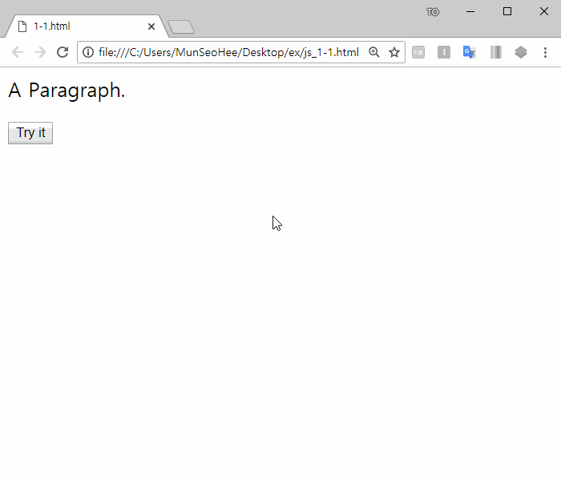
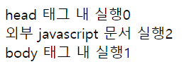
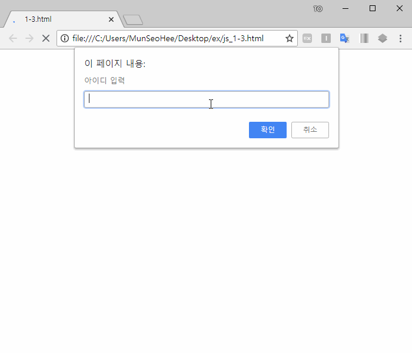
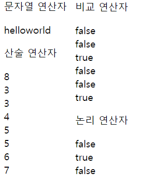
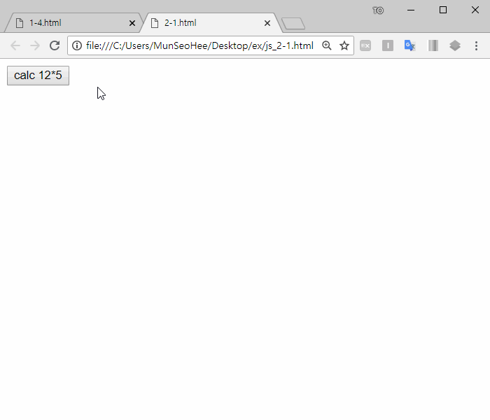
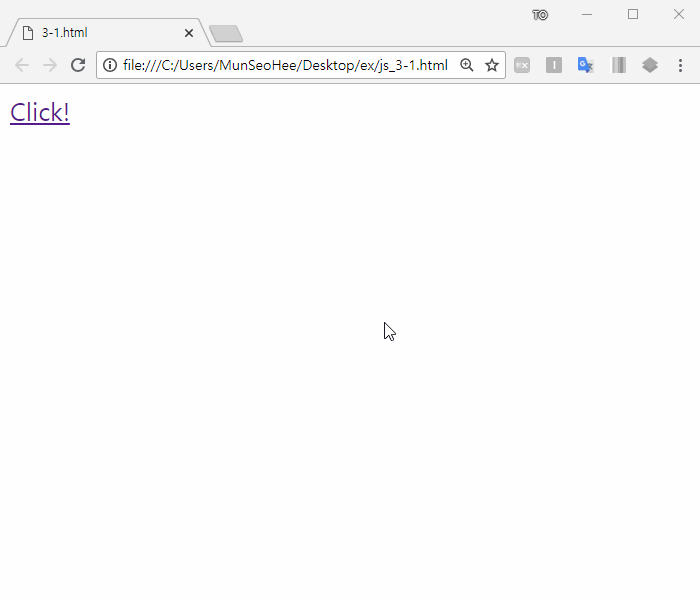
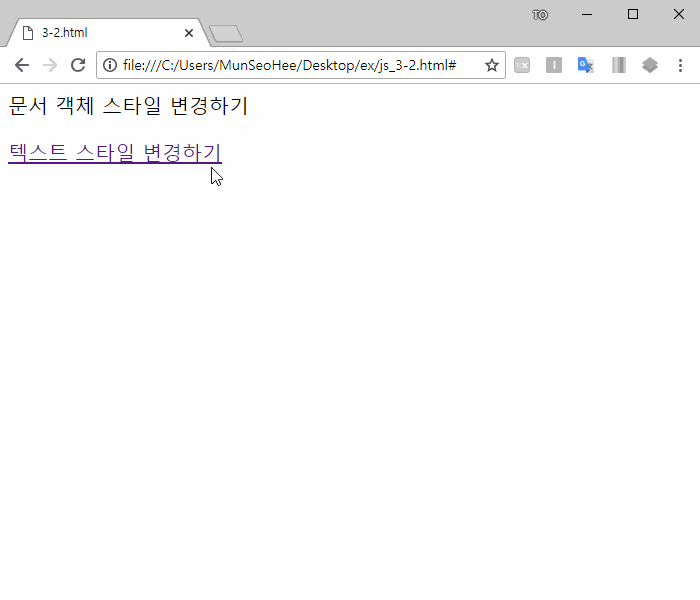

# [STS-121 실습] 웹 프론트엔드 개발 기초::HTML

[![Dinfree][din-badge]][din-url]
[![Subject][html-badge]][din-url]
[![Subject][css-badge]][din-url]
[![Subject][js-badge]][din-url]

## 시작하기 전에
이 페이지는 프론트엔드 웹 프로그래밍의 기본이 되는 [STS-121] HTML 기초 강좌의 예제 학습 페이지 입니다. 동영상이 포함된 강좌는 [STS-121][] 에서 보실수 있습니다. 이곳에서는 각 챕터별 예제들과 간단한 프로젝트형식의 종합예제를 정리해서 제공하고 있습니다. 각각의 예제는 github 리파지토리에서 받아가실수 있으며 첨부된 설명에 따라 학습을 진행하면 됩니다. 실습을 위한 모든 환경설정은 `공통기초->[STS-103]개발도구` 에서 다루었습니다. 따라서 해당학습을 진행하지 않았다면 반드시 먼저 살펴보고 실습을 진행하기 바랍니다.

### 목차
1. 기본 문법
2. 함수와 이벤트 처리
3. 문서객체모델(DOM) 

--- 

## 1. 기본 문법
### 예제 1-1) 변수 및 출력 방법
본 예제에서는 javascript에서의 변수 선언 방법을 알아보고 출력하는 방법을 학습합니다.

#### step-1> html 소스코드 작성(js_1-1.html)
js_1-1.html파일을 생성하고 javascript코드를 추가하기 전, 기본 틀을 만들기위해 다음과 같이 코드를 작성합니다.

```html
<!DOCTYPE html>
<html>
    <head>
        <title>1-1.html</title>
    </head>
    <body>
        <p id="demo">A Paragraph.</p>
        <button type="button" onclick="myFunction()">Try it</button>
    </body>
</html>
```

#### step-2> javascript 코드 작성
변수를 생성하고 innerHTML을 사용하여 html요소에 작성하는 코드입니다. javascript를 포함시키기위해 위에서 작성한 1-1.html코드의 `<head>`태그 내에 `<script>`코드 작성해주세요.

```html
<script>
    var msg = "Hello World!!";

    function myFunction() {
        document.getElementById("demo").innerHTML = msg;
    }
</script>
```

#### step-3> 실행 및 결과 확인
브라우저에서 실행결과를 확인 합니다. 아래와 같이 버튼을 누르면 `id="demo"`의 문구가 변경되는 것을 확인 할 수 있습니다.



### 예제 1-2) javascript 적용 방법
본 예제에서는 javascript를 적용시키는 방법을 알아봅니다. 

#### step-1> html 소스코드 작성(js_1-2.html)
js_1-2.html파일을 생성하고 html문서 내부에 javascript 코드를 작성하기위해 다음과 같이 코드를 작성합니다.

```html
<!DOCTYPE html>
<html>
    <head>
        <title>1-2.html</title>
        <script>
            var num=0;
            document.write("head 태그 내 실행"+num+"<br>");
        </script>
        <script src="1-2.js"></script>
    </head>
    <body>
        <script>
            var num=1;
            document.write("body 태그 내 실행"+num+"<br>");
        </script>
    </body>
</html>
```


#### step-2> javascript 소스코드 작성(1-2.js)
외부 javascript 문서를 참조 방식을 사용해보기 위해 1-2.js 파일을 생성하고 다음과 같이 코드를 작성합니다.

```javascript
var num=2;
document.write("외부 javascript 문서 실행"+num+"<br>");
```

#### step-3> 외부 문서 참조
외부 자바스크립트 문서 작성한 것을 html문서가 참조하도록 하기위해 다음과 같이 js_1-2.html를 수정합니다. 

```html
<head>
    <title>1-2.html</title>
    <script>
        var num=0;
        document.write("head 태그 내 실행"+num+"<br>");
    </script>
    <script src="1-2.js"></script>
</head>
```

#### step-4> 실행 및 결과 확인
브라우저에서 실행결과를 확인 합니다.



### 예제 1-3) 조건문
본 예제에서는 javascript의 제어문에 대해 알아봅니다.

#### step-1> html 소스코드 작성(js_1-3.html)
js_1-3.html은 로그인을 하는 프로그램입니다. 아이디와 비밀번호를 입력받고 로그인을 성공하였는지 실패하였는지 여부를 판단하기 위해 js_1-3.html파일을 생성하고 다음과 같이 코드를 작성합니다.

```html
<!DOCTYPE html>
<html>
    <head>
        <title>1-3.html</title>
    </head>
    <body>
        <p>아이디, 비밀번호 입력</p>
        <script>
            id=prompt('아이디 입력');
            if(id=='admin'){
                password=prompt('비밀번호 입력');
                if(password=='123456'){
                    window.alert('login');
                }
                else{
                    window.alert('error');
                }
            }
            else{
                window.alert('error');
            }
        </script>
    </body>
</html>
```
#### step-2> 실행 및 결과 확인
브라우저에서 실행결과를 확인 합니다.




### 예제 1-4) 연산자
본 예제에서는 문자열 연산자, 산술 연산자, 비교 연산자, 논리 연산자에대해 학습합니다.

#### step-1> 소스코드 작성(js_1-4.html)
js_1-3.html은 로그인을 하는 프로그램입니다. 아이디와 비밀번호를 입력받고 로그인을 성공하였는지 실패하였는지 여부를 판단하기 위해 js_1-3.html파일을 생성하고 다음과 같이 코드를 작성합니다.

```html
<!DOCTYPE html>
<html>
    <head>
        <title>1-4.html</title>
    </head>
    <body>
        <p>문자열 연산자</p>
        <script>
            var str1="hello";
            var str2='world';
            var str=str1+str2;
            document.write(str+"<br>");
        </script>

        <p>산술 연산자</p>
        <script>
            var num1=3;
            var num2=5; 
            document.write((num1+num2)+"<br>");
            document.write((num1%num2)+"<br>");
            document.write((num1++)+"<br>");
            document.write((num1)+"<br>");
            document.write((++num1)+"<br>");
            document.write((num2++)+"<br>");
            document.write((num2)+"<br>");
            document.write((++num2)+"<br>");
        </script>

        <p>비교 연산자</p>
        <script>
            var num1=3;
            var num2="3"; 
            document.write((num1>num2) +"<br>");
            document.write((num1<num2) +"<br>");
            document.write((num1==num2) +"<br>");
            document.write((num1===num2) +"<br>");
            document.write((num1!=num2) +"<br>");
            document.write((num1!==num2) +"<br>");
        </script>

        <p>논리 연산자</p>
        <script>
            var num1=3;
            var num2=5; 
            document.write((num1>2&&num2>6) +"<br>");
            document.write((num1>2||num2>6) +"<br>");
            document.write((!(num1>2)) +"<br>");
        </script>
    </body>
</html>
```
#### step-2> 실행 및 결과 확인
브라우저에서 실행결과를 확인 합니다.



## 2. 함수와 이벤트 처리
### 예제 2-1) 함수
본 예제에서는 javascript에서의 함수에 대해 이해하고 함수를 작성하는 방법에 대해 학습합니다.

#### step-1> 소스코드 작성(js_2-1.html)
js_2-1.html파일을 생성하고 함수를 만들어 특정한 기능을 수행하도록 하기위해 다음과 같이 코드를 작성합니다.

```html
<!DOCTYPE html>
<html>
    <head>
        <title>2-1.html</title>
        <script>
            function calc(n1,n2) {
                return n1*n2;
            }

            function myFunction(n1,n2) {
                document.getElementById("result").innerHTML = calc(n1,n2);
            }
        </script>
    </head>

    <body>
        <button type="button" onclick="myFunction(12,5)">calc 12*5</button>
        <p id="result"> </p>
    </body>
</html>
```
#### step-2> 실행 및 결과 확인
브라우저에서 실행결과를 확인 합니다.




## 3. 문서객체모델(DOM) 
### 예제 3-1) document 객체
본 예제에서는 문서객체모델이 무엇인지 알아보고 개념을 익힙니다. 문서객체모델을 어느때, 어떠한 식으로 사용하는지 학습합니다.

#### step-1> 소스코드 작성(js_3-1.html)
js_2-1.html파일을 생성하고 문서 객체를 생성하기위해 다음과 같이 코드를 작성합니다.

```html
<!DOCTYPE html>
<html>
    <head>
        <title>3-1.html</title>
        <script>
            function add(){
                var header=document.createElement('h2');
                var text=document.createTextNode('hello world');
                header.appendChild(text);
                document.body.appendChild(header);
            };
        </script>
    </head>

    <body>
        <a href="#" onclick="add()">Click!</a>
    </body>
</html>
```
#### step-2> 실행 및 결과 확인
브라우저에서 실행결과를 확인 합니다.



### 예제 3-2) 문서 객체 스타일 변경하기
본 예제에서는 문서객체의 스타일을 변경하는 방법을 학습합니다.

#### step-1> 소스코드 작성(js_3-2.html)
js_3-2.html파일을 생성하고 문서 객체의 스타일을 변경하기위해 다음과 같이 코드를 작성합니다.

```html
<!DOCTYPE html>
<html>
    <head>
        <title>3-2.html</title>
        <script>
            function textstyle(){
                document.getElementById("msg").style.color="blue";
            }
        </script>
    </head>

    <body>
        <p id="msg">문서 객체 스타일 변경하기</p>
        <a href="#" onclick="textstyle()">텍스트 스타일 변경하기</a>
    </body>
</html>
```
#### step-2> 실행 및 결과 확인
브라우저에서 실행결과를 확인 합니다.




[din-badge]:https://img.shields.io/badge/dinfree-edu-orange.svg
[din-url]:https://github.com/dinfree
[css-badge]:https://img.shields.io/badge/frontend-css-ff69b4.svg
[html-badge]:https://img.shields.io/badge/frontend-html-brightgreen.svg
[js-badge]:https://img.shields.io/badge/frontend-javascript-red.svg
